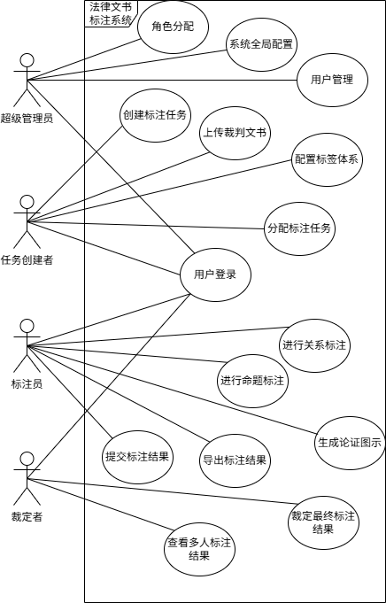

# 法律文书标注系统用例文档

## 1. 角色与相关用例
- 超级管理员：用户登录、用户管理、角色分配、系统全局配置
- 任务创建者：创建标注任务、上传裁判文书、配置标签体系、分配标注任务
- 标注员：进行命题标注、进行关系标注、提交标注结果、生成论证图示、导出标注结果
- 裁定者：查看多人标注结果、裁定最终标注结果

---

## 2. 用例图

---

## 3. 核心用例描述

### 核心用例1：进行命题标注
| 项目 | 内容 |
| ---- | ---- |
| 用例名称 | 进行命题标注 |
| 参与者 | 标注员 |
| 前置条件 | 1. 标注员已登录系统。 2. 标注员已被分配到一个已启动的标注任务，且任务处于“标注”阶段。 3. 裁判文书原文已加载在原文区。 |
| 基本流 | 1. 标注员在原文区选中一段文本片段。 2. 系统自动生成新命题，按文本出现顺序自动分配序号（如 ①, ②…）。 3. 系统在左侧命题列表中显示该命题全文及序号，并在原文区高亮该片段。 4. 标注员在中间标注区为当前命题选择一级标签（SF/GF/SM/GM）。 5. 若一级标签为 GM，标注员需进一步选择二级标签（GM-L/GM-I/GM-C/GM-U/GM-M/GM-O）。 6. 系统保存该命题的标签路径。 7. 标注员可重复步骤1-6，完成所有命题标注。 8. 标注员可随时修改已有命题的标签。 |
| 替代流 | A1. 删除命题：  - 标注员在命题列表中点击删除按钮。  - 系统删除该命题，并自动将后续所有命题序号前移（如原③变为②）。  - 原文区高亮同步移除。  - 与该命题相关的所有关系标注自动失效（需用户重新标注关系）。 A2. 试图撤销操作：系统不提供撤销/重做，仅支持删除后重新创建。 |
| 后置条件 | 标注员的命题标注结果被保存至数据库，系统仅保留最后一次提交的版本。 |

---

### 核心用例2：进行关系标注
| 项目 | 内容 |
| ---- | ---- |
| 用例名称 | 进行关系标注 |
| 参与者 | 标注员 |
| 前置条件 | 1. 标注员已完成至少两个命题的创建。 2. 标注员处于“标注”阶段。 |
| 基本流 | 1. 标注员在左侧命题列表中选中两个命题（如①和②）。 2. 在中间标注区的“关系输入区”选择关系类型：支持(S)、反对(A)、组合(J)、匹配(M)、同一(I)。 3. 系统生成形式化表达式，例如 S(①, ②) 表示①支持②。 4. 标注员点击保存，系统记录该关系。 5. 右侧论证图示区实时自动更新，用方框表示命题，箭头表示关系。 6. 标注员可继续创建更多关系。 |
| 替代流 | A1. 多命题联合关系：  - 选中三个或更多命题（如①, ②,③）。  - 选择关系类型“组合 J”，输入表达式如 J({①,②},③)。  - 系统保存并更新图示。 A2. 嵌套关系：  - 先创建一个组合关系节点（如 G1 = J(①,②)）。  - 再将 G1 与另一命题③建立关系，如 S(G1,③)。 A3. 删除关系：在关系列表中删除某关系，系统同步更新图示。 |
| 后置条件 | 关系标注结果被保存，论证图示自动更新。标注员可继续修改或新增。 |

---

### 核心用例3：裁定最终标注结果
| 项目 | 内容 |
| ---- | ---- |
| 用例名称 | 裁定最终标注结果 |
| 参与者 | 裁定者 |
| 前置条件 | 1. 同一份裁判文书已由至少两名标注员完成标注并提交。 2. 任务流转至“冲突解决”阶段。 3. 裁定者已被任务创建者指定为该任务的唯一裁定人。 |
| 基本流 | 1. 裁定者登录系统，进入待裁定任务列表。 2. 选择一项待裁定任务，系统并排展示两名标注员的标注结果（原文、命题标签、关系表达式）。 3. 系统高亮显示两份标注的差异点（如不同标签、不同关系）。 4. 裁定者逐项审查差异：  - 可采纳标注员A的标注。  - 可采纳标注员B的标注。  - 可手动修改标签或关系为全新值。 5. 裁定者确认所有差异已解决。 6. 裁定者点击“裁定生效”。 7. 系统弹出二次确认：“裁定后将不可回退，是否继续？” 8. 裁定者确认，系统保存最终版本，任务进入“结果输出”阶段。 |
| 替代流 | A1. 裁定者发现需要重新标注：  - 裁定者无法回退任务，需联系任务创建者新建任务。 A2. 部分裁定暂存：  - 裁定者只完成部分差异的裁定，点击“暂存”。系统保存当前裁定进度，允许下次继续。 |
| 后置条件 | 最终裁定版本被锁定，平台内数据不可修改，可导出。标注员只能查看最终结果，不可查看对方中间标注。 |