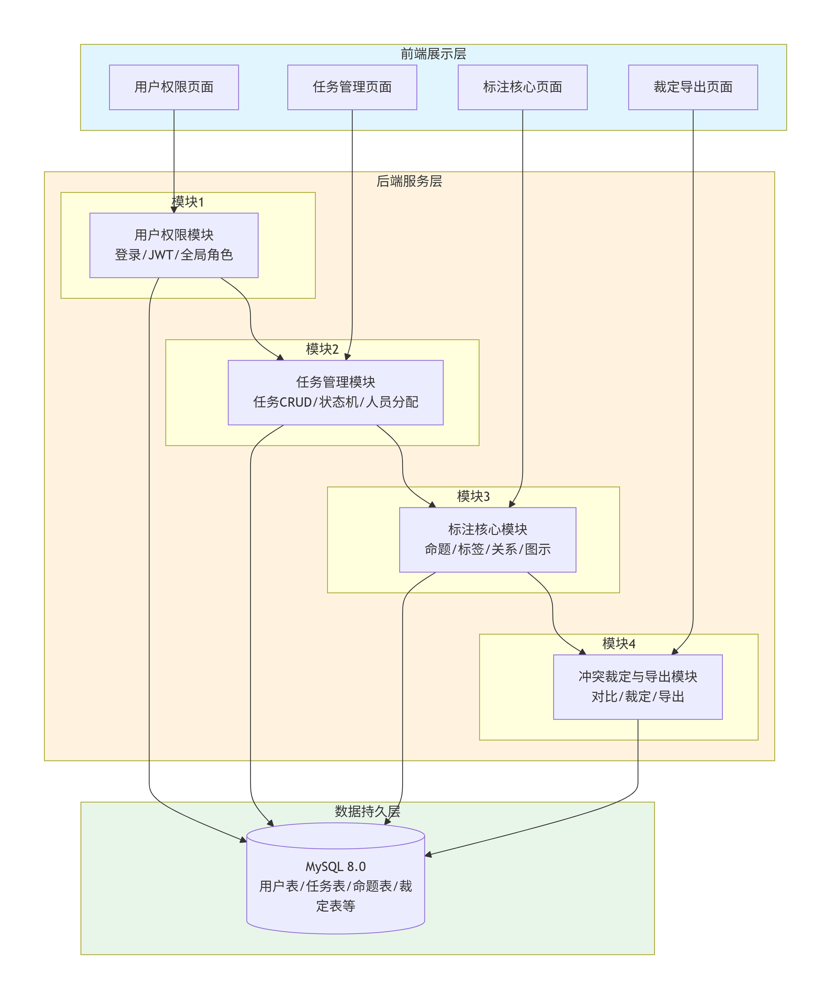

# 架构设计文档

## 4.1 架构概览

本项目采用 **模块化垂直架构 + 前后端分离**，整体分为：

- **前端展示层**（Vue3）
- **后端服务层**（Spring Boot）
- **数据持久层**（MySQL）

系统按业务功能垂直拆分为4个独立模块（用户权限、任务管理、标注核心、冲突裁定与导出），每人负责一个模块的前端+后端+数据库全栈开发。模块之间通过 RESTful API 通信，身份统一使用 JWT 校验。

**架构图如下：**

## 4.2 模块划分说明

| 模块 | 职责 | 依赖 | 核心接口示例 |
|------|------|------|-------------|
| 用户权限模块 | 登录/登出、JWT签发、全局角色管理（超级管理员/任务创建者/普通用户） | 无 | `POST /api/v1/auth/login` `PUT /api/v1/admin/users/{id}/role` |
| 任务管理模块 | 任务CRUD、四阶段状态机、全局文件库、人员分配（标注员≥2人，裁决者1人） | 用户权限模块 | `POST /api/v1/tasks` `PUT /api/v1/tasks/{id}/stage` |
| 标注核心模块 | 命题选取与自动编号、标签标注（SF/GF/SM/GM及GM二级）、关系标注（S/A/J/M/I，支持联合/嵌套）、论证图生成与拖拽 | 用户权限、任务管理 | `POST /api/v1/tasks/{id}/docs/{docId}/propositions` `PUT /api/v1/tasks/{id}/docs/{docId}/graph` |
| 冲突裁定与导出模块 | 双标注对比、裁决者人工比对/修改/采纳、终审生效、Excel/JSON/PNG/SVG导出 | 用户权限、任务管理、标注核心 | `GET /api/v1/tasks/{id}/docs/{docId}/compare` `POST /api/v1/tasks/{id}/exports` |

**模块依赖关系**：用户权限模块 → 任务管理模块 → 标注核心模块 → 冲突裁定与导出模块

**接口规范**：RESTful API + JSON + JWT（Header: `Authorization: Bearer <Token>`），统一返回格式 `{code, msg, data}`，错误码包含 200/400/401/403/404/409/422/500。

## 4.3 技术选型说明

| 层次 | 技术选型 | 选择理由 |
|------|---------|---------|
| 前端框架 | Vue 3 + Vite | 开发快、组件丰富、上手简单，Vite热更新极快，适合快速构建三栏标注界面 |
| UI组件库 | Element Plus | 生态成熟，提供丰富的表单、表格组件，快速搭建管理后台风格 |
| 后端框架 | Spring Boot | 配置简单、Web开发成熟稳定，生态完善，学生易掌握 |
| 数据库 | MySQL 8.0 | 轻量、开源、稳定；支持JSON字段存储标签快照与标注数据；课程项目完全够用 |
| 接口调试 | Axios | 支持拦截器、统一错误处理，前后端通用 |
| 身份认证 | JWT | 无状态、前后端分离天然友好，实现简单，不依赖服务端Session |
| 部署方式 | 服务器部署 + Git管理 | 面向法学院真实用户，需远程访问；前后端分别打包部署；Git管理协作版本 |

## 4.4 ADR 集合

### ADR-001：采用模块化垂直架构
- **状态**：已接受
- **背景**：4人学生团队，10周工期，无Web开发经验。传统分层架构易导致Git冲突和协作阻塞。
- **决策**：按业务功能垂直切分，每人负责一完整模块（前端+后端+数据库），模块间通过API轻量交互。
- **理由**：低耦合协作、并行效率最大化、责任明确。
- **后果**：正面：开发并行度高，冲突少；负面：公共工具可能重复实现；风险：前期需统一API格式和异常处理。
- **AI辅助**：AI初稿推荐MVC三层架构；人工改为模块化垂直架构，强调并行开发效率。

### ADR-002：采用 Vue3 + Spring Boot 前后端分离
- **状态**：已接受
- **背景**：需开发交互复杂的标注系统，团队具备Java和基础前端能力。
- **决策**：前端Vue3+Vite，后端Spring Boot，RESTful API对接，UI组件库Element Plus。
- **理由**：技术成熟稳定、开发体验好、生态丰富、便于并行开发和答辩展示。
- **后果**：正面：开发效率高；负面：需处理跨域配置；风险：需统一Node.js和Java版本。
- **AI辅助**：AI初稿推荐通用技术栈；人工锁定高确定性方案，避免实验性技术。

### ADR-003：采用 MySQL 单库存储
- **状态**：已接受
- **背景**：用户量<1000，标注数据<10万条，无高并发，团队缺乏分布式运维经验。
- **决策**：单一MySQL 8.0实例，不引入Redis/NoSQL。
- **理由**：ACID保证数据一致性、开发成本低、工具链完善、完全满足课程数据量。
- **后果**：正面：架构简单稳定；负面：未来扩展可能受限；风险：需定期备份数据。
- **AI辅助**：AI初稿直接建议MySQL；人工补充数据规模和学生运维约束，排除复杂方案。

### ADR-004：采用 JWT 无状态身份认证
- **状态**：已接受
- **背景**：前后端分离，存在跨域请求，传统Session配置繁琐。
- **决策**：使用JWT实现认证，后端签发Token，前端存储于请求头携带，后端无状态校验。
- **理由**：跨域友好、降低服务器内存压力、开发生态成熟。
- **后果**：正面：认证解耦，对接简单；负面：Token有效期内无法强制注销；风险：需防范XSS攻击，加密存储Token。
- **AI辅助**：AI初稿将JWT描述为完美方案；人工补充安全性权衡和风险防范。