# 详细设计文档（整合版）

> **团队：** 第 44 组 | **日期：** 2026 年 6 月 16 日
> **周次：** 第 10-11 周 | **阶段：** Phase 3 详细设计

本文档整合 `docs/P3/` 目录下各分项设计交付物，基于项目当前真实实现（`backend/src/main/resources/db/` + `backend/` 源码）编写。

> **2026-06-20 修订**：补充消息中心模块、`message` 表、论证图手动生成与 GraphEditor 说明；建表 SQL 以 `backend/src/main/resources/db/` 为准。

---

## 本阶段目标

1. 完成类图设计，确保符合 SOLID 原则
2. 定义 API 接口规范
3. 完成数据库设计
4. 通过 SOLID 检查实验，体验 AI 在设计层面的能力边界

---

## 一、类图设计

### 一、ER 图

#### 1.1 实体关系总览

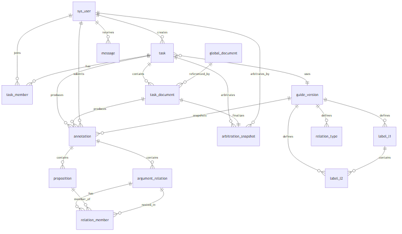

> Mermaid 源文件：[P3-ER图.mmd](../img/P3-ER图.mmd)

#### 1.2 各实体间关系

| 序号 | 源实体 | 目标实体 | 关系描述 | 基数 | 外键位置 | 备注 |
| --- | --- | --- | --- | --- | --- | --- |
| 1 | sys_user | task | 创建 | 1:N | task.creator_id → sys_user.id | 任务创建者 |
| 2 | sys_user | task_member | 参与 | 1:N | task_member.user_id → sys_user.id | 标注员 / 裁定者 |
| 3 | task | task_member | 包含成员 | 1:N | task_member.task_id → task.id | 任务级分配，非按文书分配 |
| 4 | guide_version | label_l1 | 定义 | 1:N | label_l1.guide_version_id → guide_version.id | 一级标签 |
| 5 | guide_version | label_l2 | 定义 | 1:N | label_l2.guide_version_id → guide_version.id | 二级标签（仅 GM） |
| 6 | label_l1 | label_l2 | 包含 | 1:N | label_l2.parent_l1_id → label_l1.id | GM 下挂二级标签 |
| 7 | guide_version | relation_type | 定义 | 1:N | relation_type.guide_version_id → guide_version.id | 关系类型 |
| 8 | guide_version | task | 被引用 | 1:N | task.guide_version_id → guide_version.id | 任务绑定指南版本 |
| 9 | task | task_document | 包含 | 1:N | task_document.task_id → task.id | 任务内文书 |
| 10 | global_document | task_document | 被引用 | 1:N | task_document.global_doc_id → global_document.id | 来源为 GLOBAL / RECREATE 时 |
| 11 | task | annotation | 产生 | 1:N | annotation.task_id → task.id | 标注 / 裁定记录 |
| 12 | task_document | annotation | 产生 | 1:N | annotation.document_id → task_document.id | 按文书维度存储 |
| 13 | sys_user | annotation | 提交 | 1:N | annotation.user_id → sys_user.id | 标注员或裁定者 |
| 14 | guide_version | annotation | 快照 | N:1 | annotation.guide_version_id → guide_version.id | 提交时保存 guide_snapshot |
| 15 | annotation | proposition | 包含 | 1:N | proposition.annotation_id → annotation.id | 规范化存储，非 JSON 快照 |
| 16 | annotation | argument_relation | 包含 | 1:N | argument_relation.annotation_id → annotation.id | 关系表 |
| 17 | argument_relation | relation_member | 包含成员 | 1:N | relation_member.relation_id → argument_relation.id | 关系成员 |
| 18 | proposition | relation_member | 作为成员 | 1:N | relation_member.proposition_id → proposition.id | member_type='P' |
| 19 | argument_relation | relation_member | 嵌套为成员 | 1:N | relation_member.child_relation_id → argument_relation.id | member_type='R'，支持关系嵌套 |
| 20 | task | arbitration_snapshot | 裁定 | 1:N | arbitration_snapshot.task_id → task.id | 裁定元数据 |
| 21 | task_document | arbitration_snapshot | 最终裁定 | 1:1 | arbitration_snapshot.task_document_id → task_document.id | 每文书一条裁定记录 |
| 22 | sys_user | arbitration_snapshot | 执行 | 1:N | arbitration_snapshot.arbitrator_id → sys_user.id | 裁定者 |
| 23 | sys_user | message | 接收 | 1:N | message.user_id → sys_user.id | 系统通知 |

#### 1.3 与初版设计的主要差异

| 初版设计（文档阶段） | 当前实现 | 变更原因 |
| --- | --- | --- |
| sys_role 独立角色表 + role_id 外键 | sys_user.role 字段（admin/creator/user） | 角色种类少，简化权限模型 |
| task_assignment（含 documentId、assignedBy） | task_member（任务级，无文书维度） | 标注员对任务内全部文书负责 |
| annotation 存 propositionData/relationData JSON | proposition / argument_relation / relation_member 规范化表 | 便于查询、比对、裁定差异分析 |
| arbitration 独立表存 JSON 快照 | annotation（record_type=ARBITRATION）+ arbitration_snapshot 元数据 | 复用同一套持久化逻辑 |
| export_log / export_file | 无（前端浏览器端 ZIP 导出） | 降低后端复杂度 |
| label_config 配置历史表 | annotation.guide_snapshot JSON | 提交时快照即可满足追溯需求 |
| 消息通知 | 无 | **message 表 + /api/messages**（2026-06 新增） |

---

### 二、类图总览

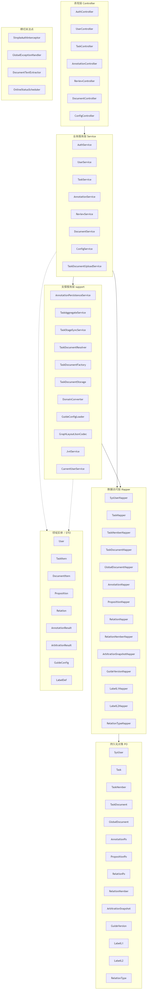

> Mermaid 源文件：[P3-类图总览.mmd](../img/P3-类图总览.mmd)

---

### 三、核心模块类图

#### 3.1 用户与认证

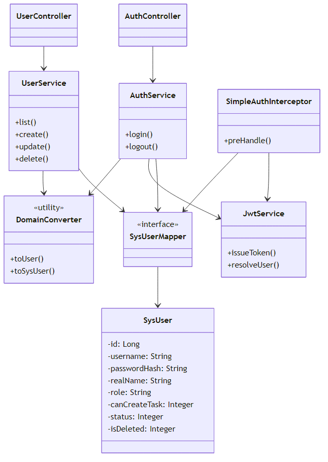

> Mermaid 源文件：[P3-用户认证类图.mmd](../img/P3-用户认证类图.mmd)

> 角色不单独建表，通过 `sys_user.role` 与 `can_create_task` 控制权限；JWT 由 `SimpleAuthInterceptor` 统一校验。

#### 3.2 任务与文书

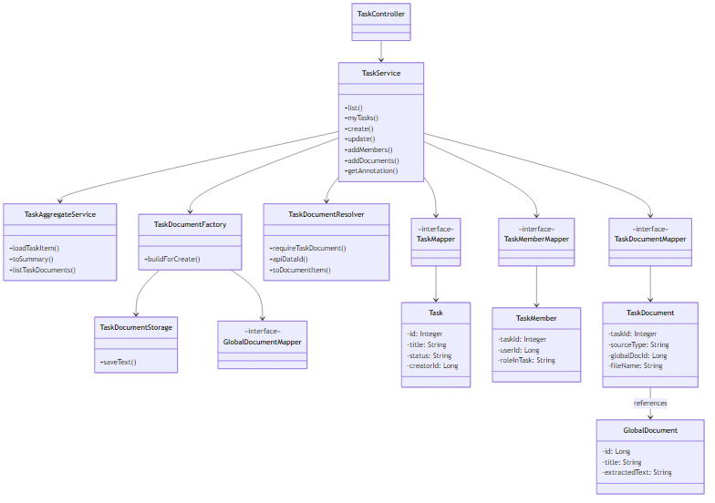

> Mermaid 源文件：[P3-任务文书类图.mmd](../img/P3-任务文书类图.mmd)

**TaskDocumentFactory（工厂模式）**：根据 `sourceType` 创建不同来源的文书记录。

| sourceType | 行为 |
| --- | --- |
| GLOBAL | 引用 global_document，不复制文本 |
| UPLOAD | 上传文本，写入 TaskDocumentStorage |
| RECREATE | 基于 global_document 重新编辑后保存 |

#### 3.3 标注核心

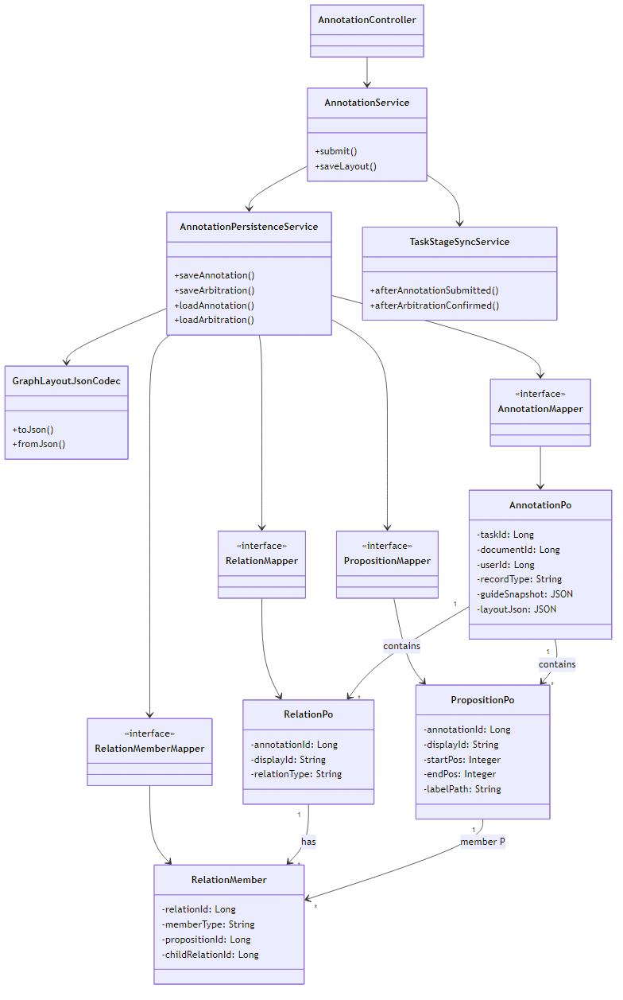

> Mermaid 源文件：[P3-标注核心类图.mmd](../img/P3-标注核心类图.mmd)

> 命题与关系以规范化表存储，通过 `annotation_id` 关联；`record_type` 区分标注员提交与裁定者最终结果。

#### 3.4 裁定

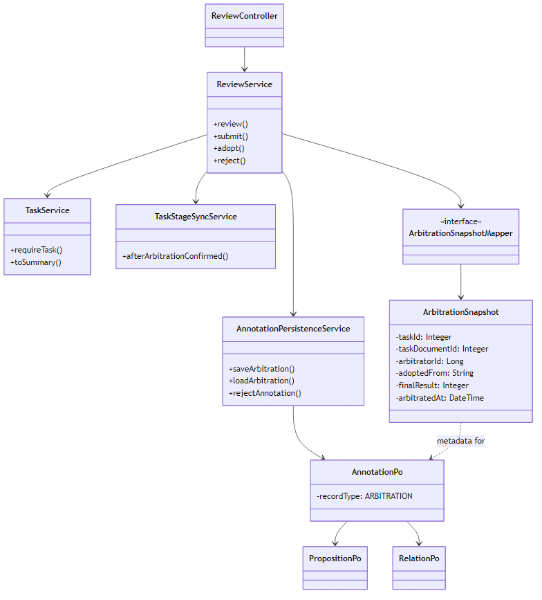

> Mermaid 源文件：[P3-裁定类图.mmd](../img/P3-裁定类图.mmd)

#### 3.5 配置中心

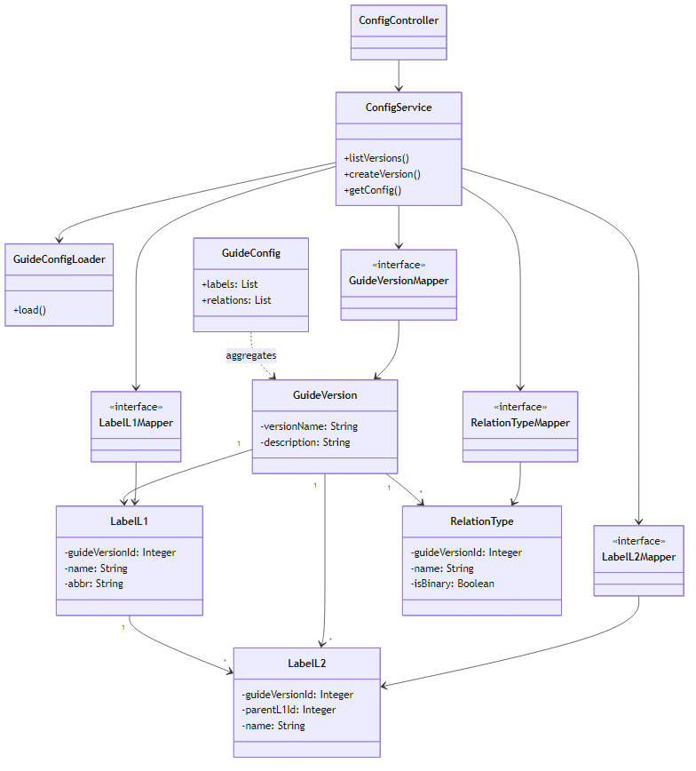

> Mermaid 源文件：[P3-配置中心类图.mmd](../img/P3-配置中心类图.mmd)

#### 3.6 文书解析（工具类）

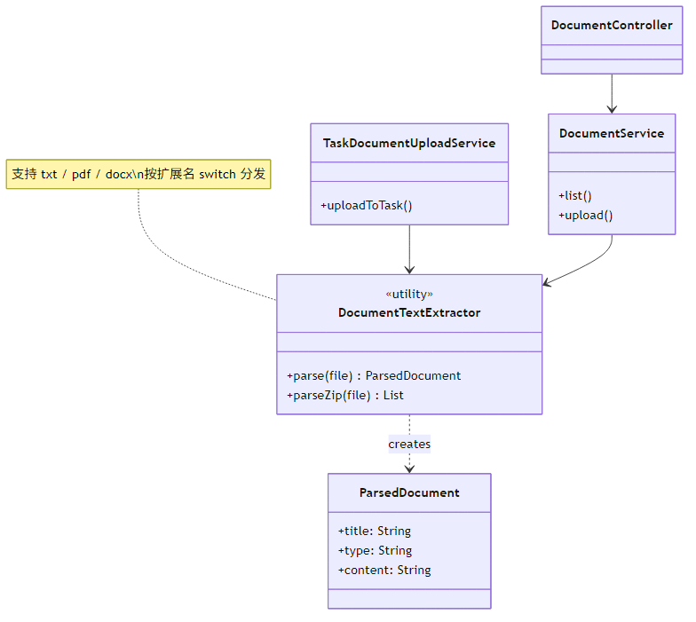

> Mermaid 源文件：[P3-文书解析类图.mmd](../img/P3-文书解析类图.mmd)

---

### 四、ER 实体与代码类映射

| 序号 | 数据库表 | PO 类 | 领域/DTO 类 | 说明 |
| --- | --- | --- | --- | --- |
| 1 | sys_user | SysUser | User, UserVO | 用户；role 内嵌，无独立 Role 表 |
| 2 | guide_version | GuideVersion | GuideConfig（聚合） | 指南版本 |
| 3 | label_l1 | LabelL1 | LabelDef | 一级标签 |
| 4 | label_l2 | LabelL2 | LabelDef | 二级标签 |
| 5 | relation_type | RelationType | LabelDef | 关系类型 |
| 6 | global_document | GlobalDocument | DocumentItem | 全局文书库 |
| 7 | task | Task | TaskItem, TaskSummary | 任务 |
| 8 | task_member | TaskMember | （嵌入 TaskItem） | 任务成员 |
| 9 | task_document | TaskDocument | DocumentItem | 任务文书 |
| 10 | annotation | AnnotationPo | AnnotationResult | 标注/裁定记录 |
| 11 | proposition | PropositionPo | Proposition | 命题 |
| 12 | argument_relation | RelationPo | Relation | 论证关系 |
| 13 | relation_member | RelationMember | （嵌入 Relation） | 关系成员 |
| 14 | arbitration_snapshot | ArbitrationSnapshot | ArbitrationResult | 裁定元数据 |

---

### 五、设计模式应用（实际落地）

#### 5.1 工厂模式 — TaskDocumentFactory

- **使用位置**：`TaskDocumentFactory.buildForCreate()`
- **原因**：任务文书有三种来源（GLOBAL / UPLOAD / RECREATE），创建逻辑差异大，集中在一处便于维护。
- **不用会怎样**：`TaskService.create()` 内会出现大量 if-else，新增来源类型需改动核心服务。

#### 5.2 分层架构 + 转换器 — DomainConverter

- **使用位置**：`DomainConverter` 负责 PO ↔ Entity/DTO 转换
- **原因**：持久化对象与 API 响应对象分离，Mapper 层不污染业务语义。
- **不用会怎样**：PO 直接暴露给 Controller，字段命名与表结构强耦合，前端接口难以稳定。

#### 5.3 阶段同步服务 — TaskStageSyncService

- **使用位置**：标注提交、裁定确认后自动推进 task / task_document 状态
- **原因**：状态流转规则（标注中 → 待裁定 → 可导出）集中管理，避免散落在多个 Service。
- **说明**：未采用完整状态模式类层次，以实用服务类实现，降低代码量。

#### 5.4 持久化聚合 — AnnotationPersistenceService

- **使用位置**：统一处理 annotation + proposition + argument_relation + relation_member 的读写
- **原因**：四张表在同一事务内联动，聚合服务保证一致性。
- **不用会怎样**：AnnotationService 与 ReviewService 重复编写相同的级联保存逻辑。

---

### 六、类之间的关系汇总

#### 6.1 持久化实体间关系（与 ER 图一致）

见 §1.2 关系表。

#### 6.2 服务层依赖关系

| 源服务 | 目标 | 说明 |
| --- | --- | --- |
| TaskService | TaskAggregateService, TaskDocumentFactory, AnnotationPersistenceService | 任务 CRUD 与标注加载 |
| AnnotationService | AnnotationPersistenceService, TaskStageSyncService | 标注提交 |
| ReviewService | AnnotationPersistenceService, TaskService, TaskStageSyncService | 裁定流程 |
| AuthService | JwtService, SysUserMapper, DomainConverter | 登录认证 |
| ConfigService | GuideConfigLoader, 各 Config Mapper | 指南配置 |

#### 6.3 分层依赖方向

```
Controller → Service → Mapper → PO (数据库)
                ↓
           Entity/DTO (DomainConverter 转换)
```

所有 Service 通过 Spring 依赖注入 Mapper 接口，符合依赖倒转（面向 MyBatis 接口编程）。

---

### 七、任务阶段状态流转

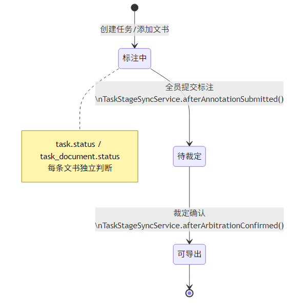

> Mermaid 源文件：[P3-任务阶段流转.mmd](../img/P3-任务阶段流转.mmd)

同步逻辑由 `TaskStageSyncService` 负责：

- `afterAnnotationSubmitted()`：检查每条文书是否全员提交
- `afterArbitrationConfirmed()`：将文书标记为可导出，并汇总任务状态

---

### 八、导出方案说明

初版设计包含 `export_log` / `export_file` 表及后端导出服务。当前实现中：

- 后端 `TaskService.export()` 已废弃（返回 HTTP 410）
- 导出由**前端在浏览器端打包 ZIP** 完成
- 因此类图中不包含 ExportLog / ExportFile / ExportCoordinator 等类

---

## 二、SOLID 检查清单


### 一、S — 单一职责原则（Single Responsibility Principle）

#### 检查问题：有没有类承担了过多职责？

**AI 初稿结论：违反，共发现 3 处。**

| 类名 | 涉及职责数 | 具体职责列表 | 违反说明 | 修正方案 |
| --- | --- | --- | --- | --- |
| `Task`（AI 初稿） | 5 | ① 生命周期 ② 人员分配 ③ 标签配置 ④ 数据导出 ⑤ 状态判断 | 领域类承担多个变更原因 | 拆分为 Task（纯数据）+ 多个 Service |
| `Annotation`（AI 初稿） | 3 | ① 数据实体 ② submit/overwrite ③ JSON 序列化 | 实体混入业务与转换逻辑 | 拆分为 AnnotationPo + AnnotationService + AnnotationPersistenceService |
| `User`（AI 初稿） | 3 | ① 数据载体 ② login/logout ③ hasPermission | 领域模型混入横切关注点 | 拆分为 SysUser + AuthService + UserService |

**实际实现对照：**

| 类名 | 当前状态 | 说明 |
| --- | --- | --- |
| `Task`（PO） | ✅ 已修正 | 仅承载字段，无业务方法 |
| `AnnotationPo` | ✅ 已修正 | 纯 POJO，持久化由 AnnotationPersistenceService 负责 |
| `SysUser` | ✅ 已修正 | 认证在 AuthService，用户管理在 UserService |
| `TaskService` | ⚠️ 部分违反 | 仍承担任务 CRUD、成员管理、文书管理、标注加载、导出占位等多项职责（约 340 行），是已知技术债 |
| `AnnotationPersistenceService` | ⚠️ 可接受 | 同时处理标注与裁定的级联持久化，但职责边界清晰（"标注数据读写"单一领域） |

---

### 二、O — 开闭原则（Open/Closed Principle）

#### 检查问题：新增需求类型是否需要修改现有代码？

**AI 初稿结论：违反，共发现 4 处。**

| 场景 | AI 初稿是否违反 | 违反说明 | 修正方案 |
| --- | --- | --- | --- |
| 新增导出格式 | **是** | `Task.exportData(format)` 需改 Task 类 | 模板方法模式 AbstractExporter |
| 新增任务角色 | **是** | assignAnnotator/assignArbitrator 硬编码 | 统一 assignMember(roleType) |
| 标签配置历史追溯 | **是** | labelConfigSnapshot JSON 死字段 | 提取 LabelConfig 独立实体 |
| 新增文件解析格式 | **轻度** | 可能退化为 if-else | DocumentParserFactory |

**实际实现对照：**

| 场景 | 当前实现 | 评估 |
| --- | --- | --- |
| 新增导出格式 | 导出改由前端 ZIP 实现，后端无导出模块 | ✅ 后端无需扩展；前端独立演进 |
| 新增任务角色 | `task_member.role_in_task` 为 ENUM('标注员','裁定者')，新增角色需改 ENUM | ⚠️ 当前仅两种角色，够用；扩展需 migration |
| 标签配置追溯 | `annotation.guide_snapshot` JSON 字段保存提交时快照 | ✅ 满足需求，未建独立 label_config 表 |
| 新增文书来源类型 | `TaskDocumentFactory` 用 switch 分发 GLOBAL/UPLOAD/RECREATE | ✅ 新增类型只需改 Factory，不侵入 TaskService 主流程 |
| 新增文件格式 | `DocumentTextExtractor` 用 switch 按扩展名解析 | ⚠️ 未用完整策略模式，但解析逻辑集中在一处 |

---

### 三、L — 里氏替换原则（Liskov Substitution Principle）

#### 检查问题：子类是否可以替换父类使用？

**AI 初稿结论：轻度违反 1 处。**

| 类/继承关系 | 是否违反 | 违反说明 | 修正方案 |
| --- | --- | --- | --- |
| `Label` 同时用于 L1/L2 | **轻度违反** | parentL1Id 对 L1 无意义，调用方需先判断 level | 工厂方法 createL1/createL2，或拆表 |

**实际实现对照：**

| 设计 | 当前实现 | 评估 |
| --- | --- | --- |
| 统一 Label 类 | 拆为 `LabelL1` / `LabelL2` 两个独立 PO 类，对应两张表 | ✅ 语义清晰，无替换歧义 |
| 用户角色继承 | 无继承层次，`SysUser.role` 字符串区分 | ✅ 避免了 AI 初稿中 Admin/Annotator 继承 User 的 LSP 问题 |

---

### 四、I — 接口隔离原则（Interface Segregation Principle）

#### 检查问题：有没有接口太"胖"，包含了不需要的方法？

**AI 初稿结论：违反 2 处。**

| 接口/类 | 是否违反 | 违反说明 | 修正方案 |
| --- | --- | --- | --- |
| Task 隐式接口 | **是** | 生命周期/分配/配置/导出方法横跨四领域 | 拆为 ITaskLifecycle / IAssignable / IExportable |
| DocumentParser | **潜在风险** | 未来可能变胖 | 拆为 IDocumentParser / IReasonExtractable |

**实际实现对照：**

| 设计 | 当前实现 | 评估 |
| --- | --- | --- |
| 服务接口层 | 未定义 ITaskLifecycle 等 Java 接口，Service 为具体类 | ⚠️ 课程设计中的接口层未完全落地；Spring 可直接注入具体 Service，对小团队可接受 |
| Mapper 接口 | MyBatis Mapper 按表拆分，粒度合理 | ✅ 每个 Mapper 只操作对应表 |
| DocumentParser | 无接口，DocumentTextExtractor 静态方法 | ⚠️ 简化为工具类，牺牲扩展性换取实现速度 |

---

### 五、D — 依赖倒转原则（Dependency Inversion Principle）

#### 检查问题：高层模块是否直接依赖了低层模块的具体实现？

**AI 初稿结论：违反 3 处。**

| 高层模块 | 直接依赖 | 是否违反 | 修正方案 |
| --- | --- | --- | --- |
| Task | ExportLog 具体类 | **是** | 引入 IExportService 接口 |
| Annotation | JSON 序列化 | **是** | AnnotationDataConverter 独立 |
| Task | labelConfigSnapshot JSON | **是** | LabelConfig 独立实体 + Repository |

**实际实现对照：**

| 模块 | 当前实现 | 评估 |
| --- | --- | --- |
| Service → 数据访问 | 所有 Service 依赖 Mapper 接口（MyBatis），由 Spring 注入 | ✅ 符合 DIP |
| 标注数据存储 | 命题/关系存规范化表，非 JSON 反序列化 | ✅ 比 AI 方案更彻底地消除实体对 JSON 的依赖 |
| 指南快照 | guide_snapshot 仍为 JSON，由 AnnotationPersistenceService 写入 | ⚠️ 可接受：快照为只读冗余，不影响核心查询路径 |
| 布局数据 | layout_json 由 GraphLayoutJsonCodec 编解码 | ✅ JSON 细节隔离在 Codec 中 |
| 导出 | 无 ExportLog 依赖 | ✅ 问题随导出方案调整而消除 |

---

### 六、SOLID 违规汇总表

| SOLID 原则 | 检查问题 | AI 初稿是否违反 | 实际实现状态 | 说明 |
| --- | --- | --- | --- | --- |
| **S** | Task 承担过多职责 | **违反** | ⚠️ 部分修正 | PO 已纯化，但 TaskService 仍偏大 |
| **S** | Annotation 混入业务+序列化 | **违反** | ✅ 已修正 | AnnotationPo + AnnotationPersistenceService |
| **S** | User 混入认证+权限 | **违反** | ✅ 已修正 | SysUser + AuthService + UserService |
| **O** | 新增导出格式 | **违反** | ✅ 方案变更 | 前端导出，后端无此扩展点 |
| **O** | 新增任务角色 | **违反** | ⚠️ ENUM 扩展 | 当前两种角色够用 |
| **O** | 配置历史追溯 | **违反** | ✅ 简化实现 | guide_snapshot 替代独立表 |
| **O** | 文书来源/解析扩展 | **轻度** | ✅ 基本满足 | Factory + Extractor 集中扩展 |
| **L** | Label 语义双重性 | **轻度违反** | ✅ 已修正 | LabelL1 / LabelL2 拆表拆类 |
| **I** | Task 胖接口 | **违反** | ⚠️ 未建接口层 | 具体 Service 类，Mapper 已隔离 |
| **I** | Parser 变胖风险 | **潜在** | ⚠️ 工具类替代 | 可接受的技术取舍 |
| **D** | Task 依赖 ExportLog | **违反** | ✅ 已消除 | 无后端导出模块 |
| **D** | Annotation 依赖 JSON | **违反** | ✅ 已修正 | 规范化表 + GraphLayoutJsonCodec |
| **D** | Task 依赖 JSON 配置 | **违反** | ⚠️ 简化 | guide_snapshot 在 annotation 表 |

---

### 七、统计

| 统计项 | AI 初稿 | 实际实现 |
| --- | --- | --- |
| SOLID 违规总数 | **13 项** | **3 项待改进**（TaskService 职责、无 Service 接口层、ENUM 角色扩展） |
| 严重违反 | 7 项 | 0 项（核心实体层已纯化） |
| 已通过修正消除 | — | 8 项 |
| 通过方案简化消除 | — | 2 项（导出、label_config） |

---

### 八、AI 原始类图（实验留存）

以下为 P3 实验中 AI 生成的初版类图结构，存在上述 SOLID 违规，**未按此实现**：

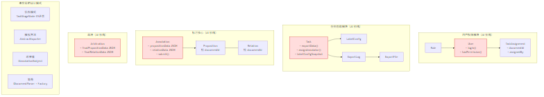

> Mermaid 源文件：[P3-AI原始类图.mmd](../img/P3-AI原始类图.mmd)

---

### 九、实际修正措施对照

| # | 原则 | AI 初稿违规点 | 实际修正措施 | 代码位置 |
| --- | --- | --- | --- | --- |
| 1 | **S** | Task 5 大职责聚合 | Task 纯 PO；业务拆入 TaskService / TaskAggregateService / TaskStageSyncService | `model/po/Task.java`, `service/` |
| 2 | **S** | Annotation 混入业务 | AnnotationPo 纯数据；AnnotationService + AnnotationPersistenceService | `model/po/AnnotationPo.java` |
| 3 | **S** | User 混入认证 | SysUser 纯数据；AuthService 负责 login/logout | `service/AuthService.java` |
| 4 | **O** | 导出格式扩展 | 前端浏览器 ZIP 导出，后端 export() 废弃 | `TaskService.export()` |
| 5 | **O** | 文书来源扩展 | TaskDocumentFactory switch 工厂 | `support/TaskDocumentFactory.java` |
| 6 | **O** | 配置历史 | annotation.guide_snapshot JSON | `annotation` 表 |
| 7 | **L** | Label 语义双重 | label_l1 / label_l2 独立表与 PO | `model/po/LabelL1.java` |
| 8 | **D** | 标注 JSON 依赖 | proposition / argument_relation / relation_member 规范化 | `backend/src/main/resources/db/` |
| 9 | **D** | 布局 JSON 依赖 | GraphLayoutJsonCodec 隔离编解码 | `support/GraphLayoutJsonCodec.java` |
| 10 | **D** | Mapper 具体实现 | MyBatis Mapper 接口 + Spring 注入 | `mapper/*.java` |

---

### 十、已知技术债

1. **TaskService 职责偏多**：任务、成员、文书、标注加载集中在一个类，后续可拆为 TaskCommandService / TaskQueryService。
2. **无 Service 接口层**：课程设计中规划的 ITaskLifecycle 等未实现，当前依赖 Spring 具体类注入。
3. **密码明文比对**：演示环境 `password_hash` 可为明文，生产需 BCrypt（AuthService 第 35 行直接 equals）。
4. **角色 ENUM 硬编码**：扩展第三角色需改表结构与应用代码。

---

## 三、API 接口规范


### 1. 文档说明

本文档基于《法律文书标注平台》系统实际后端实现进行 RESTful API 设计，用于规范前后端的数据交互方式。

系统主要包含以下模块：

- 用户与权限管理
- 文书总库管理
- 标签配置中心
- 任务管理
- 标注工作台
- 裁定工作台
- 结果查看与导出
- 消息中心

#### 系统模块架构

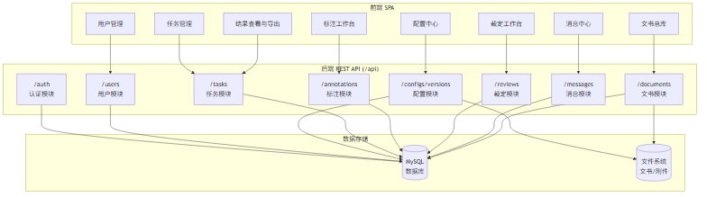

> Mermaid 源文件：[P3-系统模块架构.mmd](../img/P3-系统模块架构.mmd)

---

### 2. API 设计规范

#### 2.1 基础路径

所有接口统一以：

```http
/api
```

作为基础路径。

示例：

```http
/api/auth/login
/api/tasks
/api/documents
```

---

#### 2.2 数据格式

普通接口：

```http
Content-Type: application/json
```

文件上传接口：

```http
Content-Type: multipart/form-data
```

---

#### 2.3 身份认证

除登录接口外，其余接口均需携带 Token：

```http
Authorization: Bearer {token}
```

认证流程：

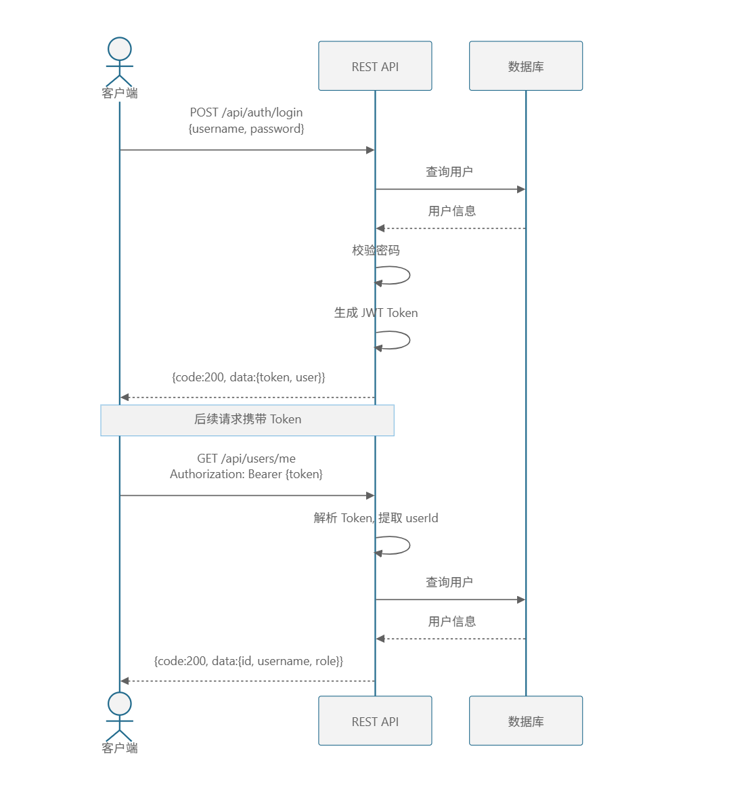

> Mermaid 源文件：[P3-认证流程.mmd](../img/P3-认证流程.mmd)

---

#### 2.4 通用响应格式

##### 成功响应

```json
{
  "code": 200,
  "message": "success",
  "data": {}
}
```

##### 失败响应

```json
{
  "code": 400,
  "message": "参数错误",
  "data": null
}
```

---

#### 2.5 统一错误码定义

| 错误码 | 含义                |
| ------ | ------------------- |
| 200    | 请求成功            |
| 400    | 请求参数错误        |
| 401    | 未登录或 Token 无效 |
| 403    | 权限不足            |
| 404    | 资源不存在          |
| 409    | 数据冲突            |
| 500    | 服务器内部错误      |

---

### 3. 用户与权限模块 API

对应页面：

- P3 用户管理

---

#### 3.1 用户登录

##### 接口说明

用户输入账号密码后登录系统。

登录成功后返回 JWT Token 与用户角色信息。

##### URL

```http
POST /api/auth/login
```

##### HTTP Method

```http
POST
```

##### 请求参数

| 参数名   | 类型   | 必填 | 说明     |
| -------- | ------ | ---- | -------- |
| username | string | 是   | 用户账号 |
| password | string | 是   | 用户密码 |

##### 请求示例

```json
{
  "username": "admin",
  "password": "123456"
}
```

##### 成功响应

```json
{
  "code": 200,
  "message": "登录成功",
  "data": {
    "token": "jwt-token-string",
    "user": {
      "id": 1,
      "username": "admin",
      "realName": "管理员",
      "role": "admin",
      "canCreateTask": true,
      "status": "在线",
      "lastSeen": "2026-05-04T10:30:00"
    }
  }
}
```

##### 失败响应

```json
{
  "code": 401,
  "message": "用户名或密码错误",
  "data": null
}
```

---

#### 3.2 用户登出

##### 接口说明

当前用户退出登录，Token 失效。

##### URL

```http
POST /api/auth/logout
```

##### 请求头

```http
Authorization: Bearer {token}
```

##### 成功响应

```json
{
  "code": 200,
  "message": "已退出",
  "data": null
}
```

---

#### 3.3 获取当前用户信息

##### 接口说明

获取当前登录用户的基本信息与角色权限。

##### URL

```http
GET /api/users/me
```

##### 请求头

```http
Authorization: Bearer {token}
```

##### 成功响应

```json
{
  "code": 200,
  "message": "success",
  "data": {
    "id": 1,
    "username": "admin",
    "realName": "管理员",
    "role": "admin",
    "canCreateTask": true,
    "status": "在线",
    "lastSeen": "2026-05-04T10:30:00"
  }
}
```

---

#### 3.4 获取用户列表

##### 接口说明

获取所有用户列表（管理员权限）。

##### URL

```http
GET /api/users
```

##### 请求头

```http
Authorization: Bearer {token}
```

##### 成功响应

```json
{
  "code": 200,
  "message": "success",
  "data": [
    {
      "id": 1,
      "username": "admin",
      "realName": "管理员",
      "role": "admin",
      "canCreateTask": true,
      "status": "在线",
      "lastSeen": "2026-05-04T10:30:00"
    }
  ]
}
```

---

#### 3.5 新增用户

##### 接口说明

管理员新增系统用户。

对应页面：

- P3 用户管理

##### URL

```http
POST /api/users
```

##### HTTP Method

```http
POST
```

##### 请求参数

| 参数名        | 类型    | 必填 | 说明                             |
| ------------- | ------- | ---- | -------------------------------- |
| username      | string  | 是   | 登录账号                         |
| realName      | string  | 是   | 用户姓名                         |
| password      | string  | 是   | 用户密码                         |
| role          | string  | 是   | admin / creator / user           |
| canCreateTask | boolean | 是   | 是否允许创建任务                 |

##### 请求示例

```json
{
  "username": "user01",
  "realName": "张三",
  "password": "123456",
  "role": "user",
  "canCreateTask": false
}
```

##### 成功响应

```json
{
  "code": 200,
  "message": "用户创建成功",
  "data": {
    "userId": 12
  }
}
```

##### 失败响应

```json
{
  "code": 409,
  "message": "用户名已存在",
  "data": null
}
```

---

#### 3.6 批量创建用户

##### 接口说明

批量导入用户。

##### URL

```http
POST /api/users/batch
```

##### 请求参数

| 参数名 | 类型  | 必填 | 说明           |
| ------ | ----- | ---- | -------------- |
| users  | array | 是   | 用户信息列表   |

##### 请求示例

```json
{
  "users": [
    {
      "username": "annotator01",
      "realName": "李四",
      "password": "123456",
      "role": "user",
      "canCreateTask": false
    },
    {
      "username": "annotator02",
      "realName": "王五",
      "password": "123456",
      "role": "user",
      "canCreateTask": false
    }
  ]
}
```

##### 成功响应

```json
{
  "code": 200,
  "message": "批量创建完成，成功 2 个用户",
  "data": [
    { "userId": 13 },
    { "userId": 14 }
  ]
}
```

---

#### 3.7 编辑用户

##### 接口说明

修改用户信息。

##### URL

```http
PUT /api/users/{id}
```

##### 请求参数

| 参数名        | 类型    | 必填 | 说明             |
| ------------- | ------- | ---- | ---------------- |
| realName      | string  | 否   | 用户姓名         |
| password      | string  | 否   | 新密码           |
| role          | string  | 否   | 角色             |
| canCreateTask | boolean | 否   | 是否允许创建任务 |

##### 成功响应

```json
{
  "code": 200,
  "message": "修改成功",
  "data": null
}
```

---

#### 3.8 删除用户

##### 接口说明

软删除指定用户（标记 is_deleted=1）。

##### URL

```http
DELETE /api/users/{id}
```

##### 成功响应

```json
{
  "code": 200,
  "message": "删除成功",
  "data": null
}
```

---

### 4. 文书总库模块 API

对应页面：

- P1 文书总库

---

#### 4.1 批量上传文书

##### 接口说明

上传 PDF、Word、TXT 文书文件。

系统自动进行：

- 文件格式校验
- 文本提取与解析

##### URL

```http
POST /api/documents/upload
```

##### 请求类型

```http
multipart/form-data
```

##### 请求参数

| 参数名 | 类型   | 必填 | 说明         |
| ------ | ------ | ---- | ------------ |
| files  | File[] | 是   | 上传文件列表 |

##### 成功响应

```json
{
  "code": 200,
  "message": "解析完成，请确认后保存",
  "data": {
    "documents": [
      {
        "title": "合同纠纷案",
        "content": "依法成立的合同..."
      }
    ]
  }
}
```

---

#### 4.2 新建文书

##### 接口说明

手动创建单篇文书（直接输入文本内容）。

##### URL

```http
POST /api/documents
```

##### 请求参数

| 参数名  | 类型   | 必填 | 说明         |
| ------- | ------ | ---- | ------------ |
| title   | string | 是   | 文书标题     |
| type    | string | 是   | 文书类型     |
| content | string | 是   | 文书文本内容 |

##### 请求示例

```json
{
  "title": "民事判决书-001",
  "type": "民事判决书",
  "content": "原告XX与被告XX合同纠纷一案..."
}
```

##### 成功响应

```json
{
  "code": 200,
  "message": "文书创建成功",
  "data": {
    "documentId": 1
  }
}
```

---

#### 4.3 获取文书列表

##### 接口说明

获取文书库列表，支持关键词搜索。

##### URL

```http
GET /api/documents
```

##### Query 参数

| 参数名  | 类型   | 必填 | 说明       |
| ------- | ------ | ---- | ---------- |
| keyword | string | 否   | 搜索关键词 |

##### 成功响应

```json
{
  "code": 200,
  "message": "success",
  "data": {
    "total": 100,
    "list": [
      {
        "id": 1,
        "documentId": "W001",
        "title": "合同纠纷案",
        "type": "民事判决书",
        "uploadDate": "2026-05-04",
        "content": "..."
      }
    ]
  }
}
```

---

#### 4.4 获取文书详情

##### URL

```http
GET /api/documents/{id}
```

##### 成功响应

```json
{
  "code": 200,
  "message": "success",
  "data": {
    "id": 1,
    "documentId": "W001",
    "title": "合同纠纷案",
    "type": "民事判决书",
    "content": "依法成立的合同，自成立时生效。"
  }
}
```

---

#### 4.5 删除文书

##### 接口说明

删除指定文书（管理员权限）。

##### URL

```http
DELETE /api/documents/{id}
```

##### 成功响应

```json
{
  "code": 200,
  "message": "删除成功",
  "data": null
}
```

---

### 5. 配置中心模块 API

对应页面：

- P2 配置中心

---

#### 5.1 获取配置版本列表

##### URL

```http
GET /api/configs/versions
```

##### 成功响应

```json
{
  "code": 200,
  "message": "success",
  "data": [
    {
      "id": 1,
      "versionName": "V1.0",
      "description": "初始版本",
      "active": true,
      "createdAt": "2026-05-01",
      "attachmentName": null,
      "primaryTags": [
        { "shortName": "GF", "name": "一般事实判断", "description": null, "parentTag": null }
      ],
      "secondaryTags": [
        { "shortName": "GM-L", "name": "法律条文", "description": null, "parentTag": "GM" }
      ],
      "relationTypes": [
        { "shortName": "S", "name": "支持", "description": null, "parentTag": null }
      ]
    }
  ]
}
```

---

#### 5.2 获取当前启用的配置

##### URL

```http
GET /api/configs/versions/active
```

##### 成功响应

同 5.1 单项结构，返回当前 `active=true` 的版本。

---

#### 5.3 获取指定配置版本

##### URL

```http
GET /api/configs/versions/{id}
```

##### 成功响应

同 5.1 单项结构。

---

#### 5.4 创建指南版本

##### 接口说明

创建新的标签配置版本。

包含：

- 一级标签
- 二级标签
- 关系类型

##### URL

```http
POST /api/configs/versions
```

##### 请求参数

```json
{
  "versionName": "V1.0",
  "description": "初始版本",
  "primaryTags": [
    {
      "shortName": "GF",
      "name": "一般事实判断"
    }
  ],
  "secondaryTags": [
    {
      "shortName": "GM-L",
      "name": "法律条文",
      "parentTag": "GM"
    }
  ],
  "relationTypes": [
    {
      "shortName": "S",
      "name": "支持",
      "isBinary": true
    }
  ]
}
```

| 字段                           | 类型    | 必填 | 说明                         |
| ------------------------------ | ------- | ---- | ---------------------------- |
| versionName                    | string  | 是   | 版本名称                     |
| description                    | string  | 否   | 版本说明                     |
| primaryTags[].shortName        | string  | 是   | 一级标签简称                 |
| primaryTags[].name             | string  | 是   | 一级标签全称                 |
| secondaryTags[].shortName      | string  | 是   | 二级标签简称                 |
| secondaryTags[].name           | string  | 是   | 二级标签全称                 |
| secondaryTags[].parentTag      | string  | 是   | 所属一级标签简称             |
| relationTypes[].shortName      | string  | 是   | 关系类型简称                 |
| relationTypes[].name           | string  | 是   | 关系类型全称                 |
| relationTypes[].isBinary       | boolean | 否   | 是否二元关系，默认 true      |

##### 成功响应

```json
{
  "code": 200,
  "message": "配置保存成功",
  "data": {
    "configId": 1
  }
}
```

---

#### 5.5 更新配置版本

##### URL

```http
PUT /api/configs/versions/{id}
```

##### 请求参数

同 5.4 创建参数结构。

##### 成功响应

```json
{
  "code": 200,
  "message": "配置更新成功",
  "data": { ... }
}
```

---

#### 5.6 删除配置版本

##### URL

```http
DELETE /api/configs/versions/{id}
```

##### 成功响应

```json
{
  "code": 200,
  "message": "删除成功",
  "data": null
}
```

---

#### 5.7 上传配置附件

##### URL

```http
POST /api/configs/versions/{id}/attachment
```

##### 请求类型

```http
multipart/form-data
```

##### 请求参数

| 参数名 | 类型 | 必填 | 说明                       |
| ------ | ---- | ---- | -------------------------- |
| file   | File | 是   | 附件文件（PDF/DOCX/TXT）   |

---

#### 5.8 下载配置附件

##### URL

```http
GET /api/configs/versions/{id}/attachment
```

##### 成功响应

返回文件流（Content-Type 根据文件类型自动设置）。

---

### 6. 任务管理模块 API

对应页面：

- P4 任务列表
- P5 我的任务
- P6 任务详情

#### 任务阶段流转


> Mermaid 源文件：[P3-任务阶段流转.mmd](../img/P3-任务阶段流转.mmd)

---

#### 6.1 创建任务

##### 接口说明

创建新的法律文书标注任务。

对应作业中的：

> 发布需求

##### URL

```http
POST /api/tasks
```

##### 请求参数

| 参数名         | 类型     | 必填 | 说明                |
| -------------- | -------- | ---- | ------------------- |
| taskName       | string   | 是   | 任务名称            |
| description    | string   | 否   | 任务描述            |
| configId       | int      | 是   | 标签配置版本ID      |
| annotatorIds   | int[]    | 是   | 标注员ID列表        |
| reviewerId     | int      | 是   | 裁定者ID            |
| documentIds    | int[]    | 是   | 文书ID列表          |
| dataSourceType | string   | 否   | 数据来源类型        |

##### 请求示例

```json
{
  "taskName": "合同法标注任务",
  "description": "对合同纠纷相关文书进行标注",
  "configId": 1,
  "annotatorIds": [2, 3],
  "reviewerId": 5,
  "documentIds": [1, 2]
}
```

##### 成功响应

```json
{
  "code": 200,
  "message": "任务创建成功",
  "data": {
    "taskId": 1001
  }
}
```

---

#### 6.2 获取任务列表

##### 接口说明

获取所有任务列表。

支持：

- 状态筛选
- 关键词搜索

##### URL

```http
GET /api/tasks
```

##### Query 参数

| 参数名  | 类型   | 必填 | 说明                       |
| ------- | ------ | ---- | -------------------------- |
| status  | string | 否   | 标注中 / 待裁定 / 可导出   |
| keyword | string | 否   | 搜索关键词                 |

##### 成功响应

```json
{
  "code": 200,
  "message": "success",
  "data": {
    "total": 20,
    "list": [
      {
        "taskId": 1001,
        "taskName": "合同法标注",
        "description": "...",
        "status": "标注中",
        "documentCount": 5,
        "annotatorCount": 2,
        "reviewerName": "赵六",
        "creatorName": "管理员",
        "creatorId": 1,
        "createdAt": "2026-05-04T10:00:00"
      }
    ]
  }
}
```

---

#### 6.3 获取我的任务

##### 接口说明

获取当前用户参与的任务（作为标注员或裁定者）。

##### URL

```http
GET /api/tasks/my
```

##### 请求头

```http
Authorization: Bearer {token}
```

##### 成功响应

结构同 6.2。

---

#### 6.4 获取任务详情

##### URL

```http
GET /api/tasks/{id}
```

##### 成功响应

```json
{
  "code": 200,
  "message": "success",
  "data": {
    "summary": {
      "taskId": 1001,
      "taskName": "合同法标注",
      "description": "...",
      "status": "标注中",
      "documentCount": 5,
      "annotatorCount": 2,
      "reviewerName": "赵六",
      "creatorName": "管理员",
      "creatorId": 1,
      "createdAt": "2026-05-04T10:00:00"
    },
    "documents": [
      {
        "id": 1,
        "documentId": "W001",
        "title": "合同纠纷案",
        "type": "民事判决书",
        "status": "标注中"
      }
    ],
    "annotators": [
      { "id": 2, "username": "annotator01", "realName": "李四" }
    ],
    "reviewer": { "id": 5, "username": "reviewer01", "realName": "赵六" },
    "configSnapshot": {
      "id": 1,
      "versionName": "V1.0",
      "primaryTags": [...],
      "secondaryTags": [...],
      "relationTypes": [...]
    }
  }
}
```

---

#### 6.5 推进任务阶段

##### 接口说明

将任务推进到下一阶段（标注中 → 待裁定 → 可导出）。

##### URL

```http
PUT /api/tasks/{id}/stage
```

##### 请求参数

| 参数名    | 类型   | 必填 | 说明               |
| --------- | ------ | ---- | ------------------ |
| newStatus | string | 是   | 目标阶段状态       |

##### 成功响应

```json
{
  "code": 200,
  "message": "阶段已推进",
  "data": { ... }
}
```

---

#### 6.6 更新任务配置

##### 接口说明

更新任务的标签配置版本。

##### URL

```http
PUT /api/tasks/{id}/config
```

##### 请求参数

| 参数名   | 类型 | 必填 | 说明           |
| -------- | ---- | ---- | -------------- |
| configId | int  | 是   | 新配置版本ID   |

##### 成功响应

```json
{
  "code": 200,
  "message": "配置已更新",
  "data": { ... }
}
```

---

#### 6.7 删除任务

##### 接口说明

删除指定任务（仅创建者可操作）。

##### URL

```http
DELETE /api/tasks/{id}
```

##### 成功响应

```json
{
  "code": 200,
  "message": "任务已删除",
  "data": null
}
```

---

#### 6.8 上传任务文书

##### 接口说明

向任务中上传新的文书文件（解析后返回前端确认）。

##### URL

```http
POST /api/tasks/documents/upload
```

##### 请求类型

```http
multipart/form-data
```

##### 请求参数

| 参数名 | 类型   | 必填 | 说明         |
| ------ | ------ | ---- | ------------ |
| files  | File[] | 是   | 上传文件列表 |

##### 成功响应

```json
{
  "code": 200,
  "message": "解析完成",
  "data": {
    "documents": [...]
  }
}
```

---

### 7. 标注工作台 API

对应页面：

- P8 标注工作台
- P11 数据选择页

#### 标注流程

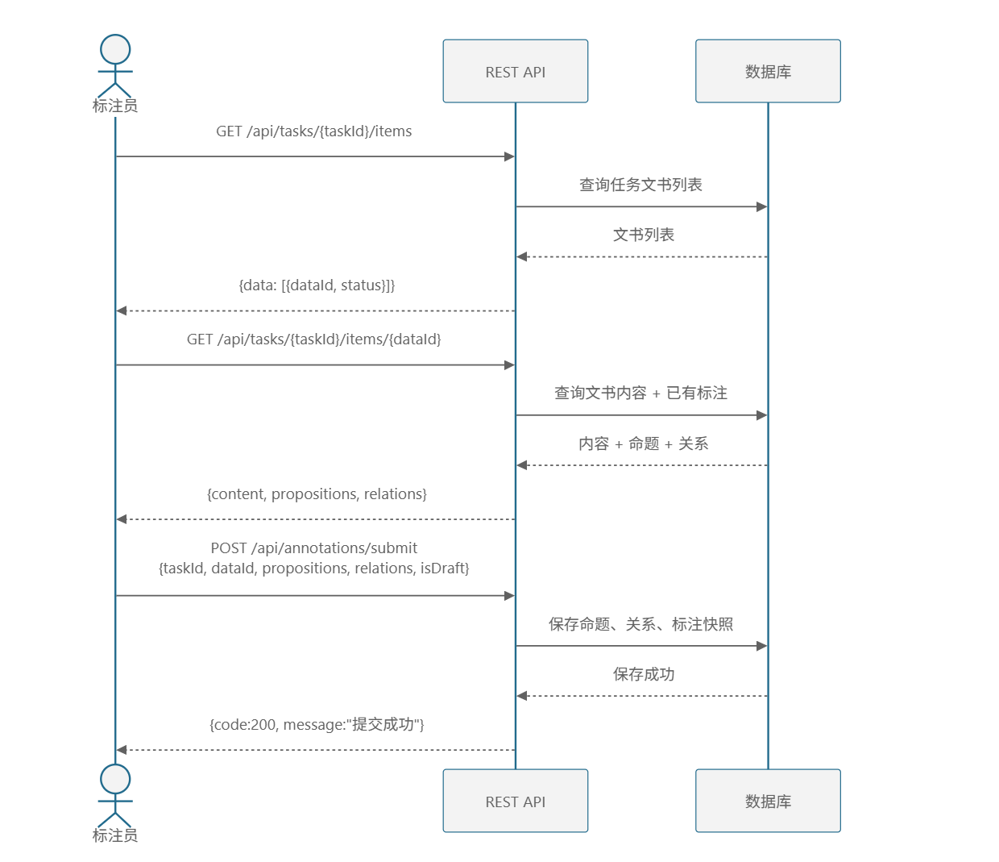

> Mermaid 源文件：[P3-标注流程.mmd](../img/P3-标注流程.mmd)

---

#### 7.1 获取待标注数据列表

##### URL

```http
GET /api/tasks/{taskId}/items
```

##### 成功响应

```json
{
  "code": 200,
  "message": "success",
  "data": [
    {
      "dataId": 1,
      "documentId": "W001",
      "title": "合同纠纷案",
      "status": "标注中"
    }
  ]
}
```

---

#### 7.2 获取标注详情

##### 接口说明

获取指定文书的标注详情。

支持查看其他标注员的标注结果（通过 sourceUserId 参数）或裁定结果（通过 sourceArbitration 参数）。

##### URL

```http
GET /api/tasks/{taskId}/items/{dataId}
```

##### Query 参数

| 参数名            | 类型    | 必填 | 说明                           |
| ----------------- | ------- | ---- | ------------------------------ |
| sourceUserId      | long    | 否   | 查看指定用户的标注结果         |
| sourceArbitration | boolean | 否   | 是否查看裁定结果               |

##### 成功响应

```json
{
  "code": 200,
  "message": "success",
  "data": {
    "content": "依法成立的合同，自成立时生效。",
    "propositions": [
      {
        "propId": "P1",
        "sequenceNo": 1,
        "startPos": 0,
        "endPos": 6,
        "text": "依法成立的合同",
        "tag": "GM-L"
      }
    ],
    "relations": [
      {
        "relId": "R1",
        "type": "S",
        "source": "P1",
        "target": "P2",
        "members": ["P1", "P2"]
      }
    ]
  }
}
```

---

#### 7.3 提交标注结果

##### 接口说明

提交或暂存标注结果。

对应作业中的：

> 提交评价

##### URL

```http
POST /api/annotations/submit
```

##### 请求参数

| 参数名       | 类型          | 必填 | 说明                       |
| ------------ | ------------- | ---- | -------------------------- |
| taskId       | long          | 是   | 任务ID                     |
| dataId       | long          | 是   | 文书数据ID                 |
| propositions | Proposition[] | 否   | 命题列表                   |
| relations    | Relation[]    | 否   | 关系列表                   |
| isDraft      | boolean       | 是   | 是否为暂存草稿             |
| graphLayout  | object        | 否   | 论证图布局信息             |

**Proposition 结构：**

| 字段       | 类型   | 说明               |
| ---------- | ------ | ------------------ |
| propId     | string | 命题标识（如 P1）  |
| sequenceNo | int    | 文中序号           |
| startPos   | int    | 起始字符位置       |
| endPos     | int    | 结束字符位置       |
| text       | string | 选中的文本片段     |
| tag        | string | 标签路径（二级标签简称） |

**Relation 结构：**

| 字段    | 类型           | 说明                       |
| ------- | -------------- | -------------------------- |
| relId   | string         | 关系标识（如 R1）          |
| type    | string         | 关系类型简称（S/M等）      |
| source  | string         | 源节点ID（命题或关系ID）   |
| target  | string         | 目标节点ID（命题或关系ID） |
| members | string[]       | 成员ID列表                 |

##### 请求示例

```json
{
  "taskId": 1001,
  "dataId": 1,
  "propositions": [
    { "propId": "P1", "sequenceNo": 1, "startPos": 0, "endPos": 6, "text": "依法成立的合同", "tag": "GM-L" },
    { "propId": "P2", "sequenceNo": 2, "startPos": 7, "endPos": 12, "text": "自成立时生效", "tag": "GM-I" }
  ],
  "relations": [
    { "relId": "R1", "type": "S", "source": "P1", "target": "P2", "members": ["P1", "P2"] }
  ],
  "isDraft": false,
  "graphLayout": null
}
```

##### 成功响应

```json
{
  "code": 200,
  "message": "提交成功",
  "data": null
}
```

---

#### 7.4 保存论证图布局

##### 接口说明

保存论证图的节点布局坐标信息。

##### URL

```http
POST /api/annotations/layout
```

##### 请求参数

| 参数名      | 类型   | 必填 | 说明           |
| ----------- | ------ | ---- | -------------- |
| taskId      | long   | 是   | 任务ID         |
| dataId      | long   | 是   | 文书数据ID     |
| graphLayout | object | 是   | 论证图布局数据 |

##### 成功响应

```json
{
  "code": 200,
  "message": "布局已保存",
  "data": null
}
```

##### 前端交互说明

在标注页完成命题与关系编辑后，需点击「**生成图示**」按钮才会刷新右侧预览。`graphLayout` 支持 `version: 1`（坐标覆盖）与 `version: 2`（GraphDocument，由全屏编辑器维护）。

---

### 8. 裁定模块 API

对应页面：

- P9 裁定界面

#### 裁定流程

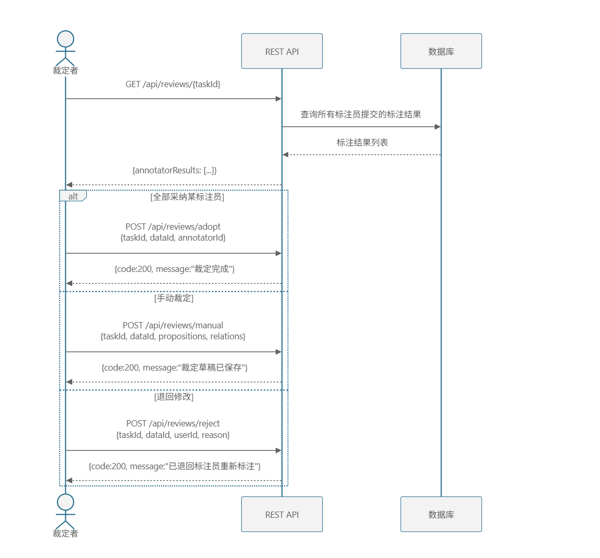

> Mermaid 源文件：[P3-裁定流程.mmd](../img/P3-裁定流程.mmd)

---

#### 8.1 获取裁定数据

##### 接口说明

获取指定任务的所有标注员提交结果，用于裁定比对。

##### URL

```http
GET /api/reviews/{taskId}
```

##### 请求头

```http
Authorization: Bearer {token}
```

##### 成功响应

```json
{
  "code": 200,
  "message": "success",
  "data": {
    "annotatorResults": [
      {
        "userId": 2,
        "userName": "李四",
        "propositions": [...],
        "relations": [...]
      }
    ]
  }
}
```

---

#### 8.2 全部采纳

##### 接口说明

直接采纳某一标注员的全部标注结果作为最终裁定。

##### URL

```http
POST /api/reviews/adopt
```

##### 请求参数

| 参数名      | 类型   | 必填 | 说明           |
| ----------- | ------ | ---- | -------------- |
| taskId      | long   | 是   | 任务ID         |
| dataId      | long   | 是   | 文书数据ID     |
| annotatorId | long   | 是   | 被采纳标注员ID |

##### 成功响应

```json
{
  "code": 200,
  "message": "裁定完成",
  "data": null
}
```

---

#### 8.3 手动裁定

##### 接口说明

裁定者手动编辑标注结果，保存为裁定草稿。

##### URL

```http
POST /api/reviews/manual
```

##### 请求参数

| 参数名       | 类型          | 必填 | 说明         |
| ------------ | ------------- | ---- | ------------ |
| taskId       | long          | 是   | 任务ID       |
| dataId       | long          | 是   | 文书数据ID   |
| propositions | Proposition[] | 否   | 裁定后命题   |
| relations    | Relation[]    | 否   | 裁定后关系   |
| graphLayout  | object        | 否   | 论证图布局   |

##### 成功响应

```json
{
  "code": 200,
  "message": "裁定草稿已保存，请在裁定界面确认",
  "data": null
}
```

---

#### 8.4 确认裁定

##### 接口说明

确认裁定结果生效。

##### URL

```http
POST /api/reviews/confirm
```

##### 请求参数

| 参数名 | 类型 | 必填 | 说明       |
| ------ | ---- | ---- | ---------- |
| taskId | long | 是   | 任务ID     |
| dataId | long | 是   | 文书数据ID |

##### 成功响应

```json
{
  "code": 200,
  "message": "裁定结果已确认",
  "data": null
}
```

---

#### 8.5 取消待确认裁定

##### 接口说明

取消之前已确认但未最终生效的裁定结果。

##### URL

```http
POST /api/reviews/cancel-pending
```

##### 请求参数

| 参数名 | 类型 | 必填 | 说明       |
| ------ | ---- | ---- | ---------- |
| taskId | long | 是   | 任务ID     |
| dataId | long | 是   | 文书数据ID |

##### 成功响应

```json
{
  "code": 200,
  "message": "已取消待确认的裁定结果",
  "data": null
}
```

---

#### 8.6 退回标注员

##### 接口说明

将标注结果退回指定标注员重新标注。

##### URL

```http
POST /api/reviews/reject
```

##### 请求参数

| 参数名 | 类型   | 必填 | 说明           |
| ------ | ------ | ---- | -------------- |
| taskId | long   | 是   | 任务ID         |
| dataId | long   | 是   | 文书数据ID     |
| userId | long   | 是   | 被退回标注员ID |
| reason | string | 是   | 退回原因       |

##### 成功响应

```json
{
  "code": 200,
  "message": "已退回标注员重新标注",
  "data": null
}
```

---

### 9. 消息中心 API

对应组件：创建者/参与者布局顶栏 `MessageCenter.vue`。

| 方法 | 路径 | 说明 |
| --- | --- | --- |
| GET | `/api/messages` | 消息列表 |
| GET | `/api/messages/unread-count` | 未读数量 |
| PUT | `/api/messages/{id}/read` | 标记已读 |
| PUT | `/api/messages/read-all` | 全部已读 |
| DELETE | `/api/messages/read` | 删除已读 |

---

### 10. 结果查看与导出 API

对应页面：

- P7 结果查看
- P10 结果导出

---

#### 10.1 获取任务结果列表

##### URL

```http
GET /api/tasks/{taskId}/results
```

##### 成功响应

```json
{
  "code": 200,
  "message": "success",
  "data": [
    {
      "taskId": 1001,
      "dataId": 1,
      "arbitratorId": 5,
      "propositions": [...],
      "relations": [...],
      "adoptedFrom": "annotator_2",
      "arbitratedAt": "2026-05-04T15:00:00",
      "finalResult": true
    }
  ]
}
```

---

#### 10.2 导出结果

##### 接口说明

导出任务标注与裁定结果。

仅任务创建者与裁定者允许导出。

##### URL

```http
GET /api/tasks/{taskId}/export
```

##### 成功响应

直接返回文件下载流。

---

### 11. API 架构总览

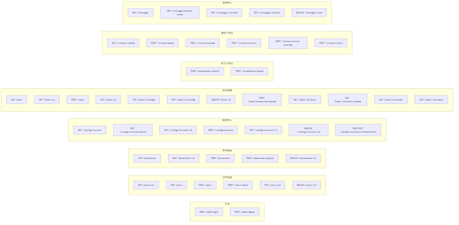

> Mermaid 源文件：[P3-API架构总览.mmd](../img/P3-API架构总览.mmd)

---

### 12. 总结

本 API 文档基于法律文书标注分析平台实际后端代码设计，共涵盖 **8 大模块 43 个接口**：

| 模块       | 接口数 | 说明                                       |
| ---------- | ------ | ------------------------------------------ |
| 认证       | 2      | 登录、登出                                 |
| 用户管理   | 6      | CRUD + 批量导入 + 当前用户信息             |
| 文书总库   | 5      | 文书上传、创建、列表、详情、删除           |
| 配置中心   | 8      | 指南版本 CRUD + 激活版本 + 附件上传下载    |
| 任务管理   | 12     | 任务 CRUD + 阶段推进 + 配置更新 + 文书管理 + 结果查看导出 |
| 标注工作台 | 2      | 标注提交、布局保存                         |
| 裁定工作台 | 6      | 裁定获取、采纳、手动裁定、确认、退回       |
| 消息中心   | 5      | 列表、未读数、已读、全部已读、删除已读     |

采用 RESTful 风格，统一 JSON 数据格式，JWT Token 认证，并对参数校验、权限控制、错误处理进行了完整设计，可支持后续 Swagger/OpenAPI 自动化生成与前后端联调开发。

---

## 四、数据库设计

---

### 1. ER 图

#### 实体属性明细表

**sys_user（用户表）**

| 字段 | 类型 | 键 | 说明 |
| --- | --- | --- | --- |
| id | BIGINT | PK | 用户唯一标识 |
| username | VARCHAR(50) | UK | 登录账号 |
| password_hash | VARCHAR(255) | | 密码 |
| real_name | VARCHAR(100) | | 真实姓名 |
| role | VARCHAR(20) | | admin / creator / user |
| can_create_task | TINYINT | | 是否可创建任务 |
| last_seen | DATETIME | | 最后活跃时间 |
| status | TINYINT | | 1=在线 0=离线 |
| is_deleted | TINYINT | | 0=正常 1=已删除 |

**guide_version（指南版本表）**

| 字段 | 类型 | 键 | 说明 |
| --- | --- | --- | --- |
| id | INT | PK | 版本ID |
| version_name | VARCHAR(100) | | 版本名称 |
| description | TEXT | | 版本说明 |
| created_at | DATETIME | | 创建时间 |
| attachment_name | VARCHAR(255) | | 附件文件名 |

**label_l1（一级标签表）**

| 字段 | 类型 | 键 | 说明 |
| --- | --- | --- | --- |
| id | INT | PK | 一级标签ID |
| guide_version_id | INT | FK | 所属指南版本 |
| name | VARCHAR(50) | | 标签全称 |
| abbr | VARCHAR(30) | | 标签简称 |
| description | TEXT | | 标签说明 |

**label_l2（二级标签表）**

| 字段 | 类型 | 键 | 说明 |
| --- | --- | --- | --- |
| id | INT | PK | 二级标签ID |
| guide_version_id | INT | FK | 所属指南版本 |
| parent_l1_id | INT | FK | 所属一级标签 |
| name | VARCHAR(50) | | 标签全称 |
| abbr | VARCHAR(30) | | 标签简称 |
| description | TEXT | | 标签说明 |

**relation_type（关系类型表）**

| 字段 | 类型 | 键 | 说明 |
| --- | --- | --- | --- |
| id | INT | PK | 关系类型ID |
| guide_version_id | INT | FK | 所属指南版本 |
| name | VARCHAR(50) | | 关系名称 |
| abbr | VARCHAR(30) | | 关系简称 |
| description | TEXT | | 关系说明 |
| is_binary | TINYINT | | 是否二元关系 |

**global_document（全局文书库表）**

| 字段 | 类型 | 键 | 说明 |
| --- | --- | --- | --- |
| id | BIGINT | PK | 文书ID |
| title | VARCHAR(255) | | 文书标题 |
| file_name | VARCHAR(255) | | 文件名 |
| file_type | VARCHAR(255) | | 用户自定义文书类型 |
| extracted_text | LONGTEXT | | 提取的纯文本 |
| uploaded_at | DATETIME | | 上传时间 |

**task（任务表）**

| 字段 | 类型 | 键 | 说明 |
| --- | --- | --- | --- |
| id | INT | PK | 任务ID |
| title | VARCHAR(100) | | 任务名称 |
| description | TEXT | | 任务描述 |
| status | ENUM | | 标注中 / 待裁定 / 可导出 |
| creator_id | BIGINT | FK | 创建者ID → sys_user.id |
| guide_version_id | INT | FK | 指南版本ID → guide_version.id |
| created_at | DATETIME | | 创建时间 |
| stage_changed_at | DATETIME | | 阶段变更时间 |
| deadline | DATETIME | | 任务截止时间（可选） |

**task_member（任务成员表）**

| 字段 | 类型 | 键 | 说明 |
| --- | --- | --- | --- |
| id | INT | PK | 分配记录ID |
| task_id | INT | FK | 任务ID → task.id |
| user_id | BIGINT | FK | 用户ID → sys_user.id |
| role_in_task | ENUM | | 标注员 / 裁定者 |

**task_document（任务文档表）**

| 字段 | 类型 | 键 | 说明 |
| --- | --- | --- | --- |
| id | INT | PK | 文档关联ID |
| task_id | INT | FK | 所属任务ID → task.id |
| source_type | ENUM | | UPLOAD / RECREATE / GLOBAL |
| global_doc_id | BIGINT | FK | 全局文书ID（可空）→ global_document.id |
| file_name | VARCHAR(255) | | 文件名 |
| file_path | VARCHAR(500) | | 存储路径 |
| extracted_text | LONGTEXT | | 纯文本内容 |
| uploaded_at | DATETIME | | 添加时间 |
| status | VARCHAR(20) | | 文书阶段状态 |

**message（消息表）**

| 字段 | 类型 | 键 | 说明 |
| --- | --- | --- | --- |
| id | BIGINT | PK | 消息ID |
| user_id | BIGINT | FK | 接收者 → sys_user.id |
| type | VARCHAR(20) | | TASK / ARBITRATION / SUBMISSION 等 |
| title | VARCHAR(200) | | 消息标题 |
| content | TEXT | | 消息正文 |
| task_id | INT | | 关联任务（可空） |
| task_document_id | INT | | 关联文书（可空） |
| data_id | INT | | 前端跳转 dataId（可空） |
| is_read | TINYINT | | 0=未读 1=已读 |
| created_at | DATETIME | | 创建时间 |

**annotation（标注结果表）**

| 字段 | 类型 | 键 | 说明 |
| --- | --- | --- | --- |
| id | BIGINT | PK | 标注记录ID |
| task_id | BIGINT | FK | 任务ID → task.id |
| document_id | BIGINT | FK | 文档ID → task_document.id |
| user_id | BIGINT | FK | 用户ID → sys_user.id |
| record_type | VARCHAR(20) | | ANNOTATION / ARBITRATION |
| status | VARCHAR(20) | | DRAFT / SUBMITTED |
| is_final | TINYINT | | 是否最终版本 |
| guide_version_id | BIGINT | | 标注时指南版本 |
| guide_snapshot | JSON | | 标签配置快照 |
| submitted_at | DATETIME | | 提交时间 |
| layout_json | JSON | | 论证图布局 |
| reject_reason | VARCHAR(500) | | 退回原因 |
| created_at | DATETIME | | 创建时间 |
| updated_at | DATETIME | | 更新时间 |

**proposition（命题表）**

| 字段 | 类型 | 键 | 说明 |
| --- | --- | --- | --- |
| id | BIGINT | PK | 命题ID |
| annotation_id | BIGINT | FK | 所属标注记录 → annotation.id |
| display_id | VARCHAR(20) | UK | 展示ID（P1, P2...） |
| sequence_no | INT | | 文中序号 |
| start_pos | INT | | 起始字符位置 |
| end_pos | INT | | 结束字符位置 |
| selected_text | TEXT | | 选中文本片段 |
| label_l1 | VARCHAR(10) | | 一级标签简称 |
| label_l2 | VARCHAR(30) | | 二级标签简称 |
| label_path | VARCHAR(50) | | 标签路径 |
| created_at | DATETIME | | 创建时间 |
| updated_at | DATETIME | | 更新时间 |

**argument_relation（关系表）**

| 字段 | 类型 | 键 | 说明 |
| --- | --- | --- | --- |
| id | BIGINT | PK | 关系ID |
| annotation_id | BIGINT | FK | 所属标注记录 → annotation.id |
| display_id | VARCHAR(20) | UK | 展示ID（R1, R2...） |
| sequence_no | INT | | 序号 |
| relation_type | VARCHAR(10) | | 关系类型简称 |
| expression | VARCHAR(500) | | 自然语言表达式 |
| created_at | DATETIME | | 创建时间 |
| updated_at | DATETIME | | 更新时间 |

**relation_member（关系成员明细表）**

| 字段 | 类型 | 键 | 说明 |
| --- | --- | --- | --- |
| id | BIGINT | PK | 成员明细ID |
| relation_id | BIGINT | FK | 所属关系ID → argument_relation.id |
| member_type | VARCHAR(1) | | P=命题 / R=关系 |
| proposition_id | BIGINT | FK | 命题ID（member_type=P）→ proposition.id |
| child_relation_id | BIGINT | FK | 子关系ID（member_type=R）→ argument_relation.id |
| member_role | VARCHAR(10) | | SOURCE / TARGET / MEMBER |
| member_order | INT | | 参数顺序 |
| created_at | DATETIME | | 创建时间 |

**arbitration_snapshot（裁定快照表）**

| 字段 | 类型 | 键 | 说明 |
| --- | --- | --- | --- |
| id | INT | PK | 裁定快照ID |
| task_id | INT | FK | 任务ID → task.id |
| task_document_id | INT | FK | 文档ID（唯一）→ task_document.id |
| arbitrator_id | BIGINT | FK | 裁定者ID → sys_user.id |
| adopted_from | VARCHAR(50) | | 采纳来源 |
| final_result | TINYINT | | 最终结果标记 |
| arbitrated_at | DATETIME | | 裁定时间 |
| based_on_annotator_id | BIGINT | FK | 裁定所依据的标注员 ID（可空） |

#### 实体间关系

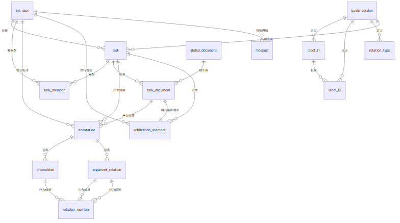

> Mermaid 源文件：[P3-实体间关系.mmd](../img/P3-实体间关系.mmd)

#### 各实体间关系明细

| 序号 | 源实体 | 目标实体 | 关系描述 | 基数 | 外键位置 | 备注 |
| --- | --- | --- | --- | --- | --- | --- |
| 1 | sys_user | task | 创建 | 1:N | task.creator_id → sys_user.id | 任务创建者 |
| 2 | sys_user | task_member | 被分配 | 1:N | task_member.user_id → sys_user.id | 用户被分配为标注员/裁定者 |
| 3 | sys_user | annotation | 提交 | 1:N | annotation.user_id → sys_user.id | 标注员提交标注 |
| 4 | sys_user | arbitration_snapshot | 执行 | 1:N | arbitration_snapshot.arbitrator_id → sys_user.id | 裁定者执行裁决 |
| 4a | sys_user | message | 接收 | 1:N | message.user_id → sys_user.id | 系统通知 |
| 5 | guide_version | label_l1 | 定义 | 1:N | label_l1.guide_version_id → guide_version.id | 版本包含一级标签 |
| 6 | guide_version | label_l2 | 定义 | 1:N | label_l2.guide_version_id → guide_version.id | 版本包含二级标签 |
| 7 | guide_version | relation_type | 定义 | 1:N | relation_type.guide_version_id → guide_version.id | 版本包含关系类型 |
| 8 | guide_version | task | 被引用 | 1:N | task.guide_version_id → guide_version.id | 一个版本可被多个任务使用 |
| 9 | label_l1 | label_l2 | 包含 | 1:N | label_l2.parent_l1_id → label_l1.id | 一级标签包含二级标签 |
| 10 | global_document | task_document | 被引用 | 1:N | task_document.global_doc_id → global_document.id | 全局文件被多个任务引用（可选） |
| 11 | task | task_member | 分配 | 1:N | task_member.task_id → task.id | 任务有多条分配记录 |
| 12 | task | task_document | 包含 | 1:N | task_document.task_id → task.id | 任务包含多个数据条目 |
| 13 | task | annotation | 产生快照 | 1:N | annotation.task_id → task.id | 任务有多个标注结果记录 |
| 14 | task | arbitration_snapshot | 产生 | 1:N | arbitration_snapshot.task_id → task.id | 任务有多个文档的裁决结果 |
| 15 | task_document | annotation | 产生快照 | 1:N | annotation.document_id → task_document.id | 文档有多个标注记录 |
| 16 | task_document | arbitration_snapshot | 拥有 | 1:1 | arbitration_snapshot.task_document_id → task_document.id (UNIQUE) | 每个文档仅一条最终裁决 |
| 17 | annotation | proposition | 包含 | 1:N | proposition.annotation_id → annotation.id | 标注记录包含多个命题 |
| 18 | annotation | argument_relation | 包含 | 1:N | argument_relation.annotation_id → annotation.id | 标注记录包含多个关系 |
| 19 | argument_relation | relation_member | 包含成员 | 1:N | relation_member.relation_id → argument_relation.id | 关系对应多条成员记录 |
| 20 | proposition | relation_member | 作为成员 | 1:N | relation_member.proposition_id → proposition.id (member_type='P') | 命题被多个关系引用 |
| 21 | argument_relation | relation_member | 作为成员 | 1:N | relation_member.child_relation_id → argument_relation.id (member_type='R') | 关系支持嵌套 |

---

### 2. 建表 SQL


#### 2.1 用户表

```sql
CREATE TABLE IF NOT EXISTS `sys_user` (
    `id` BIGINT UNSIGNED AUTO_INCREMENT COMMENT '用户唯一标识',
    `username` VARCHAR(50) NOT NULL COMMENT '登录账号',
    `password_hash` VARCHAR(255) NOT NULL COMMENT '密码（演示环境可为明文）',
    `real_name` VARCHAR(100) NOT NULL COMMENT '真实姓名',
    `role` VARCHAR(20) NOT NULL DEFAULT 'user' COMMENT 'admin / creator / user',
    `can_create_task` TINYINT NOT NULL DEFAULT 0 COMMENT '1=可创建任务',
    `last_seen` DATETIME DEFAULT NULL COMMENT '最后活跃时间',
    `status` TINYINT NOT NULL DEFAULT 0 COMMENT '1=在线 0=离线',
    `is_deleted` TINYINT NOT NULL DEFAULT 0 COMMENT '0=正常 1=已删除',
    PRIMARY KEY (`id`),
    UNIQUE KEY `uk_username` (`username`)
) ENGINE=InnoDB DEFAULT CHARSET=utf8mb4 COMMENT='用户表';
```

> 说明：角色直接存储在 `role` 字段中（VARCHAR），不设独立的角色表。用户删除采用软删除（`is_deleted` 标记）。

#### 2.2 指南版本表

```sql
CREATE TABLE IF NOT EXISTS `guide_version` (
    `id` INT UNSIGNED AUTO_INCREMENT,
    `version_name` VARCHAR(100) NOT NULL,
    `description` TEXT DEFAULT NULL,
    `created_at` DATETIME DEFAULT CURRENT_TIMESTAMP,
    `attachment_name` VARCHAR(255) DEFAULT NULL,
    PRIMARY KEY (`id`)
) ENGINE=InnoDB DEFAULT CHARSET=utf8mb4 COMMENT='指南版本';
```

> 说明：`attachment_name` 存储上传的标注规范附件文件名。

#### 2.3 一级标签表

```sql
CREATE TABLE IF NOT EXISTS `label_l1` (
    `id` INT UNSIGNED AUTO_INCREMENT,
    `guide_version_id` INT UNSIGNED NOT NULL,
    `name` VARCHAR(50) NOT NULL,
    `abbr` VARCHAR(30) NOT NULL,
    `description` TEXT DEFAULT NULL,
    PRIMARY KEY (`id`),
    UNIQUE KEY `uk_version_abbr` (`guide_version_id`, `abbr`)
) ENGINE=InnoDB DEFAULT CHARSET=utf8mb4 COMMENT='一级标签';
```

#### 2.4 二级标签表

```sql
CREATE TABLE IF NOT EXISTS `label_l2` (
    `id` INT UNSIGNED AUTO_INCREMENT,
    `guide_version_id` INT UNSIGNED NOT NULL,
    `parent_l1_id` INT UNSIGNED NOT NULL,
    `name` VARCHAR(50) NOT NULL,
    `abbr` VARCHAR(30) NOT NULL,
    `description` TEXT DEFAULT NULL,
    PRIMARY KEY (`id`),
    KEY `idx_parent_l1` (`parent_l1_id`)
) ENGINE=InnoDB DEFAULT CHARSET=utf8mb4 COMMENT='二级标签';
```

> 说明：二级标签通过 `parent_l1_id` 关联到一级标签。

#### 2.5 关系类型表

```sql
CREATE TABLE IF NOT EXISTS `relation_type` (
    `id` INT UNSIGNED AUTO_INCREMENT,
    `guide_version_id` INT UNSIGNED NOT NULL,
    `name` VARCHAR(50) NOT NULL,
    `abbr` VARCHAR(30) NOT NULL,
    `description` TEXT DEFAULT NULL,
    `is_binary` TINYINT NOT NULL DEFAULT 1,
    PRIMARY KEY (`id`),
    UNIQUE KEY `uk_version_relation_abbr` (`guide_version_id`, `abbr`)
) ENGINE=InnoDB DEFAULT CHARSET=utf8mb4 COMMENT='关系类型';
```

#### 2.6 全局文书库表

```sql
CREATE TABLE IF NOT EXISTS `global_document` (
    `id` BIGINT UNSIGNED AUTO_INCREMENT,
    `title` VARCHAR(255) NOT NULL,
    `file_name` VARCHAR(255) NOT NULL DEFAULT '',
    `file_type` VARCHAR(255) NOT NULL DEFAULT '' COMMENT '文书类型，用户自定义，如 民事判决书',
    `extracted_text` LONGTEXT NOT NULL,
    `uploaded_at` DATETIME DEFAULT CURRENT_TIMESTAMP,
    PRIMARY KEY (`id`)
) ENGINE=InnoDB DEFAULT CHARSET=utf8mb4 COMMENT='全局文书库';
```

#### 2.7 任务表

```sql
CREATE TABLE IF NOT EXISTS `task` (
    `id` INT AUTO_INCREMENT,
    `title` VARCHAR(100) NOT NULL,
    `description` TEXT DEFAULT NULL,
    `status` ENUM('标注中', '待裁定', '可导出') NOT NULL DEFAULT '标注中',
    `creator_id` BIGINT UNSIGNED NOT NULL,
    `guide_version_id` INT UNSIGNED DEFAULT NULL,
    `created_at` DATETIME DEFAULT CURRENT_TIMESTAMP,
    `stage_changed_at` DATETIME DEFAULT CURRENT_TIMESTAMP ON UPDATE CURRENT_TIMESTAMP,
    `deadline` DATETIME DEFAULT NULL COMMENT '任务截止时间',
    PRIMARY KEY (`id`),
    KEY `idx_creator_id` (`creator_id`)
) ENGINE=InnoDB DEFAULT CHARSET=utf8mb4;
```

> 说明：任务状态使用 ENUM 类型，支持三种状态：`标注中` → `待裁定` → `可导出`。

#### 2.8 任务成员表

```sql
CREATE TABLE IF NOT EXISTS `task_member` (
    `id` INT AUTO_INCREMENT,
    `task_id` INT NOT NULL,
    `user_id` BIGINT UNSIGNED NOT NULL,
    `role_in_task` ENUM('标注员', '裁定者') NOT NULL,
    PRIMARY KEY (`id`),
    UNIQUE KEY `uk_task_user_role` (`task_id`, `user_id`, `role_in_task`),
    KEY `idx_user_id` (`user_id`)
) ENGINE=InnoDB DEFAULT CHARSET=utf8mb4;
```

> 说明：任务成员不按文档粒度分配，标注员对整个任务的所有文档负责。

#### 2.9 任务文档表

```sql
CREATE TABLE IF NOT EXISTS `task_document` (
    `id` INT AUTO_INCREMENT,
    `task_id` INT NOT NULL,
    `source_type` ENUM('UPLOAD', 'RECREATE', 'GLOBAL') NOT NULL DEFAULT 'GLOBAL',
    `global_doc_id` BIGINT UNSIGNED DEFAULT NULL,
    `file_name` VARCHAR(255) NOT NULL,
    `file_path` VARCHAR(500) DEFAULT NULL,
    `extracted_text` LONGTEXT DEFAULT NULL,
    `uploaded_at` DATETIME DEFAULT CURRENT_TIMESTAMP,
    `status` VARCHAR(20) NOT NULL DEFAULT '标注中' COMMENT '文书阶段：标注中/待裁定/可导出',
    PRIMARY KEY (`id`),
    KEY `idx_task_id` (`task_id`),
    KEY `idx_global_doc_id` (`global_doc_id`)
) ENGINE=InnoDB DEFAULT CHARSET=utf8mb4;
```

> 说明：`source_type` 支持三种来源：`GLOBAL`（引用全局文书库）、`UPLOAD`（本地上传）、`RECREATE`（重新创建）。

#### 2.10 消息表

见分项文档 `数据库设计.md` §2.10；建表 SQL 位于 `backend/src/main/resources/db/creator.sql`。

#### 2.11 标注结果表

```sql
CREATE TABLE IF NOT EXISTS `annotation` (
    `id` BIGINT UNSIGNED NOT NULL AUTO_INCREMENT,
    `task_id` BIGINT UNSIGNED NOT NULL,
    `document_id` BIGINT UNSIGNED NOT NULL,
    `user_id` BIGINT UNSIGNED NOT NULL,
    `record_type` VARCHAR(20) NOT NULL DEFAULT 'ANNOTATION' COMMENT 'ANNOTATION=标注员提交, ARBITRATION=裁定结果',
    `status` VARCHAR(20) NOT NULL DEFAULT 'DRAFT',
    `is_final` TINYINT NOT NULL DEFAULT 0,
    `guide_version_id` BIGINT UNSIGNED DEFAULT NULL,
    `guide_snapshot` JSON DEFAULT NULL,
    `submitted_at` DATETIME DEFAULT NULL,
    `created_at` DATETIME NOT NULL DEFAULT CURRENT_TIMESTAMP,
    `updated_at` DATETIME NOT NULL DEFAULT CURRENT_TIMESTAMP ON UPDATE CURRENT_TIMESTAMP,
    `layout_json` JSON DEFAULT NULL COMMENT '论证图布局覆盖',
    `reject_reason` VARCHAR(500) DEFAULT NULL COMMENT '裁定不予采纳理由',
    PRIMARY KEY (`id`),
    UNIQUE KEY `uk_annotation_task_doc_user_type` (`task_id`, `document_id`, `user_id`, `record_type`),
    KEY `idx_annotation_task` (`task_id`),
    KEY `idx_annotation_doc` (`document_id`),
    KEY `idx_annotation_user` (`user_id`)
) ENGINE=InnoDB DEFAULT CHARSET=utf8mb4 COMMENT='标注结果表';
```

> 说明：
> - `record_type` 区分标注员提交（`ANNOTATION`）和裁定结果（`ARBITRATION`）。
> - `guide_snapshot` 存储标注时使用的标签配置快照（JSON 格式）。
> - `layout_json` 存储论证图的节点布局坐标。
> - `reject_reason` 存储裁定退回原因。

#### 2.12 命题表

```sql
CREATE TABLE IF NOT EXISTS `proposition` (
    `id` BIGINT UNSIGNED NOT NULL AUTO_INCREMENT,
    `annotation_id` BIGINT UNSIGNED NOT NULL,
    `display_id` VARCHAR(20) NOT NULL,
    `sequence_no` INT NOT NULL,
    `start_pos` INT NOT NULL,
    `end_pos` INT NOT NULL,
    `selected_text` TEXT NOT NULL,
    `label_l1` VARCHAR(10) NOT NULL,
    `label_l2` VARCHAR(30) DEFAULT NULL,
    `label_path` VARCHAR(50) NOT NULL,
    `created_at` DATETIME NOT NULL DEFAULT CURRENT_TIMESTAMP,
    `updated_at` DATETIME NOT NULL DEFAULT CURRENT_TIMESTAMP ON UPDATE CURRENT_TIMESTAMP,
    PRIMARY KEY (`id`),
    UNIQUE KEY `uk_prop_annotation_display` (`annotation_id`, `display_id`),
    UNIQUE KEY `uk_prop_annotation_sequence` (`annotation_id`, `sequence_no`),
    KEY `idx_prop_annotation_range` (`annotation_id`, `start_pos`, `end_pos`),
    CONSTRAINT `fk_prop_annotation`
        FOREIGN KEY (`annotation_id`) REFERENCES `annotation` (`id`)
        ON DELETE CASCADE
) ENGINE=InnoDB DEFAULT CHARSET=utf8mb4 COMMENT='命题表';
```

> 说明：
> - 命题通过 `annotation_id` 关联到标注记录，而非直接关联文档。
> - `display_id` 是前端展示用的命题标识（如 P1、P2）。
> - `label_l1` / `label_l2` 冗余存储标签简称，便于快速读取。
> - `label_path` 存储完整标签路径（如 `GM-L`）。

#### 2.13 关系表

```sql
CREATE TABLE IF NOT EXISTS `argument_relation` (
    `id` BIGINT UNSIGNED NOT NULL AUTO_INCREMENT,
    `annotation_id` BIGINT UNSIGNED NOT NULL,
    `display_id` VARCHAR(20) NOT NULL,
    `sequence_no` INT NOT NULL,
    `relation_type` VARCHAR(10) NOT NULL,
    `expression` VARCHAR(500) DEFAULT NULL,
    `created_at` DATETIME NOT NULL DEFAULT CURRENT_TIMESTAMP,
    `updated_at` DATETIME NOT NULL DEFAULT CURRENT_TIMESTAMP ON UPDATE CURRENT_TIMESTAMP,
    PRIMARY KEY (`id`),
    UNIQUE KEY `uk_rel_annotation_display` (`annotation_id`, `display_id`),
    UNIQUE KEY `uk_rel_annotation_sequence` (`annotation_id`, `sequence_no`),
    KEY `idx_rel_annotation_type` (`annotation_id`, `relation_type`),
    CONSTRAINT `fk_rel_annotation`
        FOREIGN KEY (`annotation_id`) REFERENCES `annotation` (`id`)
        ON DELETE CASCADE
) ENGINE=InnoDB DEFAULT CHARSET=utf8mb4 COMMENT='关系表';
```

> 说明：
> - 关系表名为 `argument_relation`，通过 `annotation_id` 关联标注记录。
> - 关系的嵌套通过 `relation_member` 表实现（member_type='R' 时引用其他关系）。
> - `expression` 字段存储关系的自然语言表达式。

#### 2.14 关系成员明细表

```sql
CREATE TABLE IF NOT EXISTS `relation_member` (
    `id` BIGINT UNSIGNED NOT NULL AUTO_INCREMENT,
    `relation_id` BIGINT UNSIGNED NOT NULL,
    `member_type` VARCHAR(1) NOT NULL,
    `proposition_id` BIGINT UNSIGNED DEFAULT NULL,
    `child_relation_id` BIGINT UNSIGNED DEFAULT NULL,
    `member_role` VARCHAR(10) NOT NULL DEFAULT 'MEMBER',
    `member_order` INT NOT NULL DEFAULT 1,
    `created_at` DATETIME NOT NULL DEFAULT CURRENT_TIMESTAMP,
    PRIMARY KEY (`id`),
    KEY `idx_member_relation` (`relation_id`),
    KEY `idx_member_relation_order` (`relation_id`, `member_order`),
    KEY `idx_member_prop_ref` (`proposition_id`),
    KEY `idx_member_rel_ref` (`child_relation_id`),
    CONSTRAINT `fk_member_relation`
        FOREIGN KEY (`relation_id`) REFERENCES `argument_relation` (`id`)
        ON DELETE CASCADE,
    CONSTRAINT `fk_member_prop`
        FOREIGN KEY (`proposition_id`) REFERENCES `proposition` (`id`)
        ON DELETE CASCADE,
    CONSTRAINT `fk_member_child_relation`
        FOREIGN KEY (`child_relation_id`) REFERENCES `argument_relation` (`id`)
        ON DELETE CASCADE,
    CONSTRAINT `chk_member_ref` CHECK (
        (`member_type` = 'P' AND `proposition_id` IS NOT NULL AND `child_relation_id` IS NULL)
        OR
        (`member_type` = 'R' AND `proposition_id` IS NULL AND `child_relation_id` IS NOT NULL)
    )
) ENGINE=InnoDB DEFAULT CHARSET=utf8mb4 COMMENT='关系成员表';
```

> 设计要点：
> - `member_type` 为 `P` 时引用命题（`proposition_id`），为 `R` 时引用子关系（`child_relation_id`）。
> - `CHECK` 约束确保两种类型互斥，保证数据完整性。
> - 支持关系嵌套：关系可包含子关系作为成员。

#### 2.15 裁定快照表

```sql
CREATE TABLE IF NOT EXISTS `arbitration_snapshot` (
    `id` INT AUTO_INCREMENT,
    `task_id` INT NOT NULL,
    `task_document_id` INT NOT NULL,
    `arbitrator_id` BIGINT UNSIGNED NOT NULL,
    `adopted_from` VARCHAR(50) DEFAULT NULL,
    `final_result` TINYINT NOT NULL DEFAULT 0,
    `arbitrated_at` DATETIME DEFAULT NULL,
    `based_on_annotator_id` BIGINT UNSIGNED DEFAULT NULL COMMENT '裁定基于的标注员ID',
    PRIMARY KEY (`id`),
    UNIQUE KEY `uk_task_doc` (`task_id`, `task_document_id`)
) ENGINE=InnoDB DEFAULT CHARSET=utf8mb4 COMMENT='裁定快照';
```

> 说明：
> - 每个文档只有一条最终裁定记录（UNIQUE `uk_task_doc`）。
> - `adopted_from` 记录采纳来源（如 `annotator_2` 表示采纳了标注员2的结果，或 `manual` 表示手动裁定）。
> - `based_on_annotator_id` 记录「全部采纳」时对应的标注员用户 ID。
> - 最终的命题和关系数据存储在 `annotation` 表中（`record_type='ARBITRATION'`）。

---

### 3. 数据存储架构

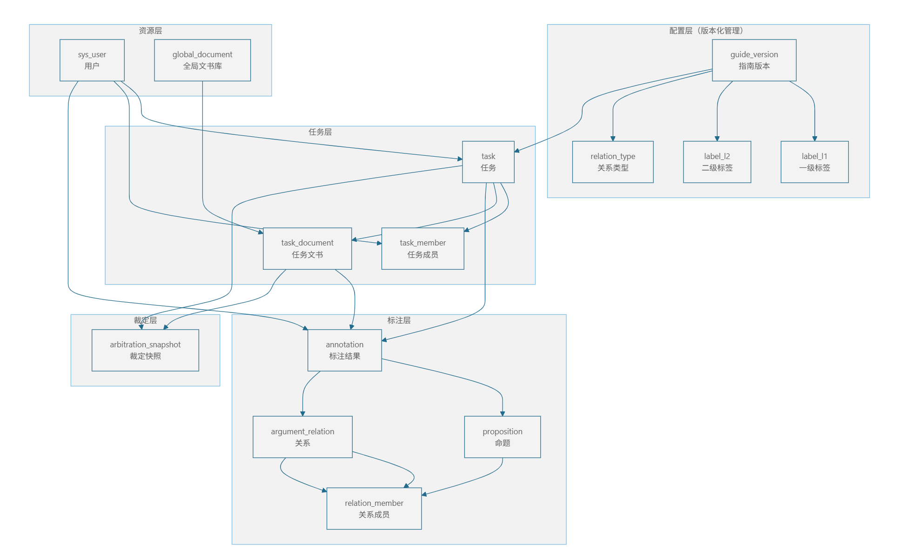

> Mermaid 源文件：[P3-数据存储架构.mmd](../img/P3-数据存储架构.mmd)

---

### 4. 索引设计表

| 表名 | 索引名称 | 索引字段 | 索引类型 | 设计原因 |
| --- | --- | --- | --- | --- |
| sys_user | PRIMARY | id | 主键 | 唯一标识每条记录 |
| sys_user | uk_username | username | 唯一索引 | 登录时根据用户名查询，要求唯一且快速定位 |
| guide_version | PRIMARY | id | 主键 | 唯一标识每条记录 |
| label_l1 | PRIMARY | id | 主键 | 唯一标识每条记录 |
| label_l1 | uk_version_abbr | (guide_version_id, abbr) | 唯一复合索引 | 保证同一版本下一级标签简称唯一 |
| label_l2 | PRIMARY | id | 主键 | 唯一标识每条记录 |
| label_l2 | idx_parent_l1 | parent_l1_id | 普通索引 | 查询某个一级标签下的所有二级标签 |
| relation_type | PRIMARY | id | 主键 | 唯一标识每条记录 |
| relation_type | uk_version_relation_abbr | (guide_version_id, abbr) | 唯一复合索引 | 保证关系类型简称唯一；支持按版本快速加载 |
| global_document | PRIMARY | id | 主键 | 唯一标识每条记录 |
| task | PRIMARY | id | 主键 | 唯一标识每条记录 |
| task | idx_creator_id | creator_id | 普通索引 | 查询某个创建者创建的所有任务 |
| task_member | PRIMARY | id | 主键 | 唯一标识每条记录 |
| task_member | uk_task_user_role | (task_id, user_id, role_in_task) | 唯一复合索引 | 防止重复分配；同时覆盖查询某任务的所有成员 |
| task_member | idx_user_id | user_id | 普通索引 | 查询用户参与的所有任务 |
| task_document | PRIMARY | id | 主键 | 唯一标识每条记录 |
| task_document | idx_task_id | task_id | 普通索引 | **核心索引**：查询某个任务下的所有数据条目 |
| task_document | idx_global_doc_id | global_doc_id | 普通索引 | 查询某个全局文件被哪些任务引用 |
| annotation | PRIMARY | id | 主键 | 唯一标识每条记录 |
| annotation | uk_annotation_task_doc_user_type | (task_id, document_id, user_id, record_type) | 唯一复合索引 | 保证每个用户对每个文档每种记录类型仅一条 |
| annotation | idx_annotation_task | task_id | 普通索引 | 按任务批量加载所有标注结果（裁决比对） |
| annotation | idx_annotation_doc | document_id | 普通索引 | 按文档查询标注结果 |
| annotation | idx_annotation_user | user_id | 普通索引 | 查询某个用户的所有标注记录 |
| proposition | PRIMARY | id | 主键 | 唯一标识每条记录 |
| proposition | uk_prop_annotation_display | (annotation_id, display_id) | 唯一复合索引 | 同一标注记录内 display_id 唯一 |
| proposition | uk_prop_annotation_sequence | (annotation_id, sequence_no) | 唯一复合索引 | 支持按序号排序和重排 |
| proposition | idx_prop_annotation_range | (annotation_id, start_pos, end_pos) | 复合索引 | 按文本位置范围查询命题 |
| argument_relation | PRIMARY | id | 主键 | 唯一标识每条记录 |
| argument_relation | uk_rel_annotation_display | (annotation_id, display_id) | 唯一复合索引 | 同一标注记录内 display_id 唯一 |
| argument_relation | uk_rel_annotation_sequence | (annotation_id, sequence_no) | 唯一复合索引 | 支持按序号排序和重排 |
| argument_relation | idx_rel_annotation_type | (annotation_id, relation_type) | 复合索引 | 按关系类型筛选 |
| relation_member | PRIMARY | id | 主键 | 唯一标识每条记录 |
| relation_member | idx_member_relation | relation_id | 普通索引 | 查询某个关系的所有成员 |
| relation_member | idx_member_relation_order | (relation_id, member_order) | 复合索引 | 按顺序加载关系成员 |
| relation_member | idx_member_prop_ref | proposition_id | 普通索引 | **反向查询**：查找哪些关系引用了某个命题 |
| relation_member | idx_member_rel_ref | child_relation_id | 普通索引 | **反向查询**：查找哪些关系引用了某个子关系 |
| arbitration_snapshot | PRIMARY | id | 主键 | 唯一标识每条记录 |
| arbitration_snapshot | uk_task_doc | (task_id, task_document_id) | 唯一复合索引 | 确保每个文档仅一条最终裁决结果 |

---

## 五、AI 协作反思日志 #3

### 团队：第 44 组

### 日期：2026 年 6 月 16 日（根据实际实现回溯修订）

---

### 1. 本阶段 AI 使用清单

| 任务 | AI 工具 | Prompt 摘要 | AI 输出质量 (1-5) | 人工修改幅度 (%) |
| --- | --- | --- | --- | --- |
| 类图生成 | DeepSeek | 基于法律文书标注平台需求，生成覆盖用户、任务、文书、标注、裁定模块的核心类图 | 3 | 70 |
| SOLID 原则初检 | 通义千问 | 对类图逐条 SOLID 检查，指出违规点并给出修正理由 | 2 | 80 |
| 设计模式推荐 | Kimi | 推荐至少 2 种设计模式并说明适用场景 | 3 | 60 |
| API 文档生成 | 通义千问 | 按 RESTful 生成登录、任务、标注、裁定等核心接口文档 | 3 | 50 |
| API 问题审查 | 通义千问 | 审查命名、权限、参数校验、错误处理、安全认证 | 3 | 40 |
| ER 图 + 建表 SQL | DeepSeek | 生成用户、任务、标注、配置等核心表的 ER 图与 SQL | 3 | 65 |
| 数据库设计审查 | Kimi | 审查第三范式、索引、隐私存储、性能瓶颈 | 2 | 75 |
| **实现阶段对照修订** | Cursor | 对照 `backend/src/main/resources/db/` 与 backend 源码，重构 P3 文档使其反映真实架构 | 4 | 90 |

---

### 2. AI 助力分析（Q1）

#### 核心助力点

- **结构脚手架**：AI 能在 1 小时内产出类图框架、API 模板、18 表建表 SQL 初稿，使团队快速进入评审而非从零画框图。
- **SOLID 审查清单**：AI 批量指出 Task 胖类、JSON 快照反模式、接口未鉴权等问题，为人工评审提供了检查条目。
- **规范参考**：RESTful 风格、统一响应体、错误码分段（100xx/200xx…）等建议被 API 文档部分采纳。
- **实现阶段**：用 AI 对照源码与文档差异，快速生成修订版 ER 关系表与类映射，节省手工核对时间。

#### 助力效果量化

- 设计初稿完成效率提升约 **60%**。
- AI 提出的 **8 条建议被最终实现采纳**（标注规范化存储、AuthService 拆分、TaskDocumentFactory、guide_snapshot、前端导出等）。
- AI 辅助识别 **5 个设计风险**；其中 3 个在实现前修正，2 个以简化方案绕过（导出模块、label_config 历史表）。

---

### 3. AI 误导分析（Q2）

#### 量化数据

SOLID 检查中发现的 AI 设计问题数量：**13 处**（S:3, O:4, L:1, I:2, D:3）

#### 最严重的设计问题

**AI 将标注结果存为 annotation 表的 JSON 快照（propositionData / relationData）**，导致：

- 无法按命题位置、标签路径做 SQL 查询与差异比对；
- 裁定模块难以逐条对比两名标注员的命题差异；
- 违反数据库规范化，且让 Annotation 实体承担序列化职责。

**实际修正**：改为 `proposition` / `argument_relation` / `relation_member` 三张规范化表，通过 `annotation_id` 关联；裁定结果复用同一结构，`record_type` 区分 ANNOTATION 与 ARBITRATION。

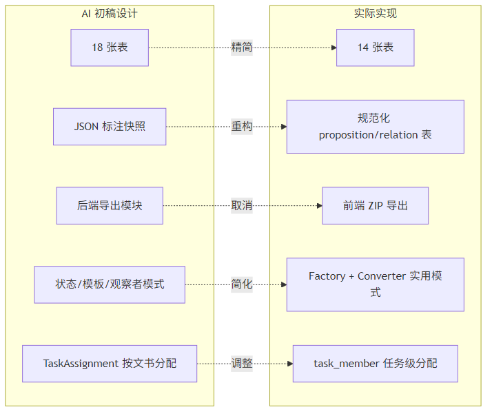

> Mermaid 源文件：[P3-设计对比图.mmd](../img/P3-设计对比图.mmd)

#### 其他典型误导

| 维度 | AI 误导内容 | 实际处理 |
| --- | --- | --- |
| 数据库 | 设计 18 张表，含 sys_role、export_log、label_config | 精简为 **15 张表**（含 message），角色内嵌、前端导出、快照替代配置历史 |
| 类图 | 大量未落地的设计模式（状态模式四子类、AbstractExporter、观察者模式） | 仅落地 Factory（TaskDocumentFactory）和 Converter（DomainConverter） |
| 权限 | 建议 Admin/Annotator/Reviewer 继承 User | 改为 sys_user.role 字符串 + JWT 拦截器，避免 LSP 问题 |
| 安全 | 建议密码 BCrypt，但初稿 SQL 示例仍为明文 | 演示环境暂用明文比对，文档中标注为技术债 |
| 任务分配 | task_assignment 按文书+角色分配 | 简化为 task_member 任务级分配，符合实际业务流程 |

#### 误导原因分析

- **过度设计倾向**：AI 倾向于套用教科书模式（状态模式、模板方法、观察者），超出课程项目所需复杂度。
- **业务理解浅**：不理解"多标注员独立提交 → 裁定者比对 → 确认导出"的实际流程，将裁定存为独立 JSON 表。
- **文档与代码脱节**：P3 交付时文档描述的是"理想架构"，实现阶段为赶进度做了大量简化，直到本次才统一修订。

---

### 4. Prompt 改进计划（Q3）

#### 上阶段改进措施的验证结果

| 上阶段措施 | 验证结果 |
| --- | --- |
| Prompt 中增加业务约束 | 格式更规范，但 AI 仍生成不适用的设计模式 |
| 强调 SOLID 自检 | 表面违规减少，但 JSON 快照等深层问题依旧 |
| 要求附带索引与范式说明 | SQL 初稿可用，但与最终实现差异大 |

#### 本阶段新的改进措施

| 优化方向 | 问题 | 改进后 Prompt 思路 |
| --- | --- | --- |
| 类图生成 | 生成未实现的抽象接口层 | 要求输出必须标注"已实现 / 规划中"，并引用现有类名 |
| 数据库设计 | 18 表过度设计 | 明确要求对照核心用例（标注提交、裁定比对）论证每张表的必要性 |
| 文档维护 | 文档与代码脱节 | 实现里程碑后增加一步："对照 init.sql 修订 ER 图" |
| 设计模式 | 堆砌模式 | 限定"仅推荐项目中已出现的模式"，并要求给出代码路径 |

---

### 5. 本阶段的核心工程判断

#### 决策 1：标注数据规范化存储

- **内容**：命题与关系从 JSON 快照改为独立表，以 `annotation_id` 为外键。
- **为什么 AI 无法决策**：AI 默认选 JSON 快照因为"实现快"，但无法理解裁定模块需要按字段比对、按位置查询的业务需求。

#### 决策 2：取消后端导出模块

- **内容**：删除 export_log / export_file 表，导出改由前端 ZIP 打包。
- **为什么 AI 无法决策**：AI 按"完整平台"假设设计后端导出流水线，未考虑团队工期与"结果查看页已有所需数据"的实际场景。

#### 决策 3：任务成员任务级分配

- **内容**：用 task_member 替代 task_assignment，不按单篇文书分配标注员。
- **为什么 AI 无法决策**：AI 按通用"工单-文档"模型设计细粒度分配，但实际业务中一名标注员负责整个任务的全部文书。

#### 决策 4：裁定数据复用 annotation 表

- **内容**：`record_type=ARBITRATION` 的 annotation 记录 + arbitration_snapshot 元数据表。
- **为什么 AI 无法决策**：AI 倾向于为裁定单独建表存 JSON，无法权衡"复用持久化逻辑"与"表语义清晰"之间的工程折中。

#### 决策 5：保留 TaskService 不继续拆分

- **内容**：明知 TaskService 职责偏多，但课程工期内不再拆分为多个 Service。
- **为什么 AI 无法决策**：AI 会机械建议"拆分为 6 个 Service"，但不评估拆分带来的 Spring 注入复杂度与团队熟悉成本。

---

### 6. 文档修订说明

本次根据 `backend/src/main/resources/db/` 与 `backend/src/main/java/edu/nju/jap/` 源码，对以下交付物进行了回溯修订（**2026-06-20 追加**：消息模块、论证图交互、task.deadline 等）：

| 文档 | 修订要点 |
| --- | --- |
| 类图（修正稿）.md | **15 表** ER 图、实际分层架构、真实类名与依赖关系 |
| SOLID检查清单.md | 区分 AI 初稿违规 vs 实现状态，诚实记录技术债 |
| AI 协作反思日志.md | 本文档，补充实现阶段对照与工程决策 |

#### 图表源文件与生成方式

所有 Mermaid 源文件位于 `docs/img/P3-*.mmd`，对应 PNG 已生成。修改图表后可用以下命令重新导出：

```bash
# 安装（仅需一次）
npm install -g @mermaid-js/mermaid-cli

# 单张导出
cd docs/img
mmdc -i P3-ER图.mmd -o P3-ER图.png -b white

# 批量导出全部 P3 图表（PowerShell）
Get-ChildItem P3-*.mmd | ForEach-Object { mmdc -i $_.Name -o ($_.BaseName + ".png") -b white }
```

也可使用 [Mermaid Live Editor](https://mermaid.live/) 在线粘贴 `.mmd` 内容后导出 PNG/SVG。

---

## 六、交付物清单

| 序号 | 交付物 | 所在位置 |
| --- | --- | --- |
| 1 | 类图 | 本文档 §一；分项文档 `类图（修正稿）.md` |
| 2 | SOLID 检查清单 | 本文档 §二；分项文档 `SOLID检查清单.md` |
| 3 | API 规范文档 | 本文档 §三；分项文档 `法律文书标注平台_API_规范文档.md` |
| 4 | ER 图 + 建表 SQL | 本文档 §四；分项文档 `数据库设计.md` |
| 5 | 详细设计文档（整合版） | 本文档 |
| 6 | AI 协作反思日志 #3 | 本文档 §五；分项文档 `AI 协作反思日志.md` |