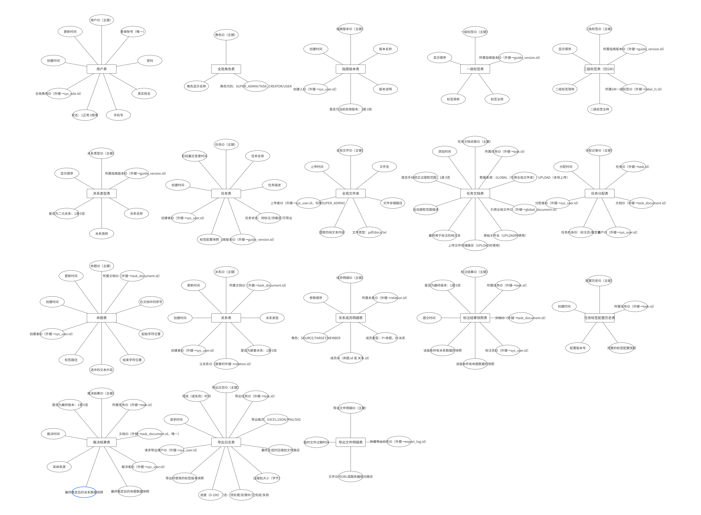
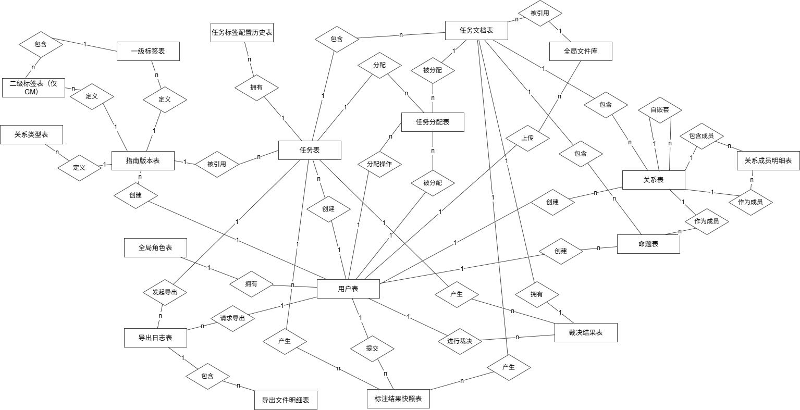

# 详细设计文档

### 团队：第44组

### 日期：5月16日

## 一、类图设计


## 二、API设计

### **1.总览：**

本节基于《法律文书标注平台》系统需求与界面设计进行 RESTful API 设计，用于规范前后端的数据交互方式。

系统主要包含以下模块：

- 用户与权限管理
- 文书总库管理
- 标签配置中心
- 任务管理
- 标注工作台
- 裁定工作台
- 结果查看与导出

### 2. API 设计规范

#### 2.1 基础路径

所有接口统一以：

```http
/api
```

作为基础路径。

示例：

```http
/api/auth/login
/api/tasks
/api/documents
```

------

### 2.2 数据格式

普通接口：

```http
Content-Type: application/json
```

文件上传接口：

```http
Content-Type: multipart/form-data
```

------

#### 2.3 身份认证

除登录接口外，其余接口均需携带 Token：

```http
Authorization: Bearer {token}
```

------

#### 2.4 通用响应格式

##### 成功响应

```json
{
  "code": 200,
  "message": "success",
  "data": {}
}
```

##### 失败响应

```json
{
  "code": 400,
  "message": "参数错误",
  "data": null
}
```

------

#### 2.5 统一错误码定义

| 错误码 | 含义                |
| ------ | ------------------- |
| 200    | 请求成功            |
| 400    | 请求参数错误        |
| 401    | 未登录或 Token 无效 |
| 403    | 权限不足            |
| 404    | 资源不存在          |
| 409    | 数据冲突            |
| 500    | 服务器内部错误      |

------

### 3. 用户与权限模块 API

对应页面：

- P3 用户管理

------

#### 3.1 用户登录

##### 接口说明

用户输入账号密码后登录系统。

登录成功后返回 JWT Token 与用户角色信息。

##### URL

```http
POST /api/auth/login
```

##### HTTP Method

```http
POST
```

##### 请求参数

| 参数名   | 类型   | 必填 | 说明     |
| -------- | ------ | ---- | -------- |
| username | string | 是   | 用户账号 |
| password | string | 是   | 用户密码 |

##### 请求示例

```json
{
  "username": "admin",
  "password": "123456"
}
```

##### 成功响应

```json
{
  "code": 200,
  "message": "登录成功",
  "data": {
    "token": "jwt-token-string",
    "user": {
      "id": 1,
      "username": "admin",
      "role": "admin"
    }
  }
}
```

##### 失败响应

```json
{
  "code": 401,
  "message": "用户名或密码错误",
  "data": null
}
```

##### 错误码定义

| 错误码 | 说明       |
| ------ | ---------- |
| 400    | 参数为空   |
| 401    | 登录失败   |
| 500    | 服务器异常 |

------

#### 3.2 获取当前用户信息

##### 接口说明

获取当前登录用户的基本信息与角色权限。

##### URL

```http
GET /api/users/me
```

##### 请求头

```http
Authorization: Bearer {token}
```

##### 成功响应

```json
{
  "code": 200,
  "message": "success",
  "data": {
    "id": 1,
    "username": "admin",
    "role": "admin"
  }
}
```

##### 失败响应

```json
{
  "code": 401,
  "message": "Token 无效",
  "data": null
}
```

##### 错误码定义

| 错误码 | 说明       |
| ------ | ---------- |
| 401    | Token 无效 |
| 500    | 服务器异常 |

------

#### 3.3 新增用户

##### 接口说明

管理员新增系统用户。

对应页面：

- P3 用户管理

##### URL

```http
POST /api/users
```

##### HTTP Method

```http
POST
```

##### 请求参数

| 参数名        | 类型    | 必填 | 说明                             |
| ------------- | ------- | ---- | -------------------------------- |
| username      | string  | 是   | 登录账号                         |
| realName      | string  | 是   | 用户姓名                         |
| password      | string  | 是   | 用户密码                         |
| role          | string  | 是   | admin/creator/annotator/reviewer |
| canCreateTask | boolean | 是   | 是否允许创建任务                 |

##### 请求示例

```json
{
  "username": "user01",
  "realName": "张三",
  "password": "123456",
  "role": "annotator",
  "canCreateTask": false
}
```

##### 成功响应

```json
{
  "code": 200,
  "message": "用户创建成功",
  "data": {
    "userId": 12
  }
}
```

##### 失败响应

```json
{
  "code": 409,
  "message": "用户名已存在",
  "data": null
}
```

##### 错误码定义

| 错误码 | 说明     |
| ------ | -------- |
| 400    | 参数缺失 |
| 403    | 权限不足 |
| 409    | 用户重复 |
| 500    | 创建失败 |

------

#### 3.4 编辑用户

##### 接口说明

修改用户信息。

##### URL

```http
PUT /api/users/{userId}
```

##### 请求参数

| 参数名        | 类型    | 必填 | 说明             |
| ------------- | ------- | ---- | ---------------- |
| realName      | string  | 否   | 用户姓名         |
| password      | string  | 否   | 新密码           |
| canCreateTask | boolean | 否   | 是否允许创建任务 |

##### 成功响应

```json
{
  "code": 200,
  "message": "修改成功",
  "data": null
}
```

##### 失败响应

```json
{
  "code": 404,
  "message": "用户不存在",
  "data": null
}
```

##### 错误码定义

| 错误码 | 说明       |
| ------ | ---------- |
| 400    | 参数非法   |
| 403    | 无权限     |
| 404    | 用户不存在 |
| 500    | 修改失败   |

------

#### 3.5 删除用户

##### 接口说明

删除指定用户。

##### URL

```http
DELETE /api/users/{userId}
```

##### 请求参数

| 参数名 | 类型 | 必填 | 说明   |
| ------ | ---- | ---- | ------ |
| userId | int  | 是   | 用户ID |

##### 成功响应

```json
{
  "code": 200,
  "message": "删除成功",
  "data": null
}
```

##### 失败响应

```json
{
  "code": 403,
  "message": "权限不足",
  "data": null
}
```

##### 错误码定义

| 错误码 | 说明       |
| ------ | ---------- |
| 403    | 权限不足   |
| 404    | 用户不存在 |
| 500    | 删除失败   |

------

### 4. 文书总库模块 API

对应页面：

- P1 文书总库

------

#### 4.1 批量上传文书

##### 接口说明

上传 PDF、Word、TXT 文书文件。

系统自动进行：

- 文件格式校验
- 哈希去重校验

##### URL

```http
POST /api/documents/upload
```

##### 请求类型

```http
multipart/form-data
```

##### 请求参数

| 参数名 | 类型   | 必填 | 说明         |
| ------ | ------ | ---- | ------------ |
| files  | File[] | 是   | 上传文件列表 |

##### 成功响应

```json
{
  "code": 200,
  "message": "上传成功",
  "data": {
    "count": 5
  }
}
```

##### 失败响应

```json
{
  "code": 400,
  "message": "文件格式错误",
  "data": null
}
```

##### 错误码定义

| 错误码 | 说明         |
| ------ | ------------ |
| 400    | 文件格式错误 |
| 409    | 文件重复上传 |
| 500    | 上传失败     |

------

#### 4.2 获取文书列表

##### 接口说明

获取文书库列表。

支持：

- 文书ID筛选
- 标题筛选
- 上传时间筛选

##### URL

```http
GET /api/documents
```

##### Query 参数

| 参数名     | 类型   | 必填 | 说明     |
| ---------- | ------ | ---- | -------- |
| documentId | string | 否   | 文书ID   |
| title      | string | 否   | 文书标题 |
| uploadDate | string | 否   | 上传日期 |
| page       | int    | 否   | 页码     |
| size       | int    | 否   | 每页数量 |

##### 成功响应

```json
{
  "code": 200,
  "message": "success",
  "data": {
    "total": 100,
    "list": [
      {
        "documentId": "W001",
        "title": "合同纠纷案",
        "uploadDate": "2026-05-04"
      }
    ]
  }
}
```

##### 失败响应

```json
{
  "code": 500,
  "message": "查询失败",
  "data": null
}
```

##### 错误码定义

| 错误码 | 说明     |
| ------ | -------- |
| 400    | 参数错误 |
| 500    | 查询失败 |

------

### 5. 配置中心模块 API

对应页面：

- P2 配置中心

------

#### 5.1 创建指南版本

##### 接口说明

创建新的标签配置版本。

包含：

- 一级标签
- 二级标签
- 关系类型

##### URL

```http
POST /api/configs/versions
```

##### 请求参数

```json
{
  "versionName": "V1.0",
  "primaryTags": [
    {
      "name": "一般事实判断",
      "shortName": "GF"
    }
  ],
  "secondaryTags": [
    {
      "name": "法律条文",
      "shortName": "GM-L"
    }
  ],
  "relationTypes": [
    {
      "name": "支持",
      "shortName": "S"
    }
  ]
}
```

##### 成功响应

```json
{
  "code": 200,
  "message": "配置保存成功",
  "data": {
    "configId": 1
  }
}
```

##### 失败响应

```json
{
  "code": 400,
  "message": "版本名称不能为空",
  "data": null
}
```

##### 错误码定义

| 错误码 | 说明     |
| ------ | -------- |
| 400    | 参数错误 |
| 403    | 权限不足 |
| 500    | 保存失败 |

------

### 6. 任务管理模块 API

对应页面：

- P4
- P5
- P6

------

#### 6.1 创建任务

##### 接口说明

创建新的法律文书标注任务。

对应作业中的：

> 发布需求

##### URL

```http
POST /api/tasks
```

##### 请求参数

| 参数名         | 类型     | 必填 | 说明                |
| -------------- | -------- | ---- | ------------------- |
| taskName       | string   | 是   | 任务名称            |
| configId       | int      | 是   | 标签配置ID          |
| annotatorIds   | int[]    | 是   | 标注员列表          |
| reviewerId     | int      | 是   | 裁定者ID            |
| dataSourceType | string   | 是   | text/upload/library |
| content        | string   | 否   | 文本内容            |
| documentIds    | string[] | 否   | 文书ID列表          |

##### 请求示例

```json
{
  "taskName": "合同法标注任务",
  "configId": 1,
  "annotatorIds": [2,3],
  "reviewerId": 5,
  "dataSourceType": "library",
  "documentIds": ["W001","W002"]
}
```

##### 成功响应

```json
{
  "code": 200,
  "message": "任务创建成功",
  "data": {
    "taskId": 1001
  }
}
```

##### 失败响应

```json
{
  "code": 400,
  "message": "标注员不能为空",
  "data": null
}
```

##### 错误码定义

| 错误码 | 说明       |
| ------ | ---------- |
| 400    | 参数不完整 |
| 403    | 无权限     |
| 404    | 配置不存在 |
| 500    | 创建失败   |

------

#### 6.2 获取任务列表

##### 接口说明

获取任务列表。

支持：

- 角色筛选
- 状态筛选
- 关键词搜索

对应作业中的：

> 浏览需求列表

##### URL

```http
GET /api/tasks
```

##### Query 参数

| 参数名  | 类型   | 必填 | 说明                       |
| ------- | ------ | ---- | -------------------------- |
| role    | string | 否   | creator/annotator/reviewer |
| status  | string | 否   | 标注中/裁决中/已完成       |
| keyword | string | 否   | 搜索关键词                 |
| page    | int    | 否   | 页码                       |
| size    | int    | 否   | 每页数量                   |

##### 成功响应

```json
{
  "code": 200,
  "message": "success",
  "data": {
    "total": 20,
    "list": [
      {
        "taskId": 1001,
        "taskName": "合同法标注",
        "status": "标注中"
      }
    ]
  }
}
```

##### 错误码定义

| 错误码 | 说明     |
| ------ | -------- |
| 400    | 参数错误 |
| 500    | 查询失败 |

------

#### 6.3 获取任务详情

##### 接口说明

获取指定任务详细信息。

对应作业中的：

> 查看订单详情

##### URL

```http
GET /api/tasks/{taskId}
```

##### 请求参数

| 参数名 | 类型 | 必填 | 说明   |
| ------ | ---- | ---- | ------ |
| taskId | int  | 是   | 任务ID |

##### 成功响应

```json
{
  "code": 200,
  "message": "success",
  "data": {
    "taskId": 1001,
    "taskName": "合同法任务",
    "status": "标注中",
    "annotators": [],
    "reviewer": {}
  }
}
```

##### 错误码定义

| 错误码 | 说明       |
| ------ | ---------- |
| 404    | 任务不存在 |
| 500    | 查询失败   |

------

### 7. 标注工作台 API

对应页面：

- P8 标注工作台
- P11 数据选择页

------

#### 7.1 获取待标注数据列表

##### URL

```http
GET /api/tasks/{taskId}/items
```

##### Query 参数

| 参数名 | 类型   | 必填 | 说明          |
| ------ | ------ | ---- | ------------- |
| status | string | 否   | 待标注/已标注 |

##### 成功响应

```json
{
  "code": 200,
  "message": "success",
  "data": [
    {
      "dataId": "D001",
      "status": "待标注"
    }
  ]
}
```

##### 错误码定义

| 错误码 | 说明       |
| ------ | ---------- |
| 404    | 任务不存在 |
| 500    | 查询失败   |

------

#### 7.2 获取标注详情

##### URL

```http
GET /api/tasks/{taskId}/items/{dataId}
```

##### 成功响应

```json
{
  "code": 200,
  "message": "success",
  "data": {
    "content": "依法成立的合同，自成立时生效。",
    "propositions": [],
    "relations": []
  }
}
```

##### 错误码定义

| 错误码 | 说明       |
| ------ | ---------- |
| 404    | 数据不存在 |
| 500    | 查询失败   |

------

#### 7.3 提交标注结果

##### 接口说明

提交或暂存标注结果。

对应作业中的：

> 提交评价

##### URL

```http
POST /api/annotations/submit
```

##### 请求参数

```json
{
  "taskId": 1001,
  "dataId": "D001",
  "propositions": [],
  "relations": [],
  "isDraft": false
}
```

##### 成功响应

```json
{
  "code": 200,
  "message": "提交成功",
  "data": null
}
```

##### 失败响应

```json
{
  "code": 400,
  "message": "关系非法",
  "data": null
}
```

##### 错误码定义

| 错误码 | 说明         |
| ------ | ------------ |
| 400    | 关系结构非法 |
| 403    | 无标注权限   |
| 404    | 数据不存在   |
| 500    | 提交失败     |

------

### 8. 裁定模块 API

对应页面：

- P9 裁定界面

------

#### 8.1 获取裁定数据

##### URL

```http
GET /api/reviews/{taskId}
```

##### 成功响应

```json
{
  "code": 200,
  "message": "success",
  "data": {
    "annotatorResults": []
  }
}
```

##### 错误码定义

| 错误码 | 说明       |
| ------ | ---------- |
| 403    | 无裁定权限 |
| 404    | 任务不存在 |

------

#### 8.2 全部采纳

##### URL

```http
POST /api/reviews/adopt
```

##### 请求参数

| 参数名      | 类型 | 必填 | 说明           |
| ----------- | ---- | ---- | -------------- |
| taskId      | int  | 是   | 任务ID         |
| annotatorId | int  | 是   | 被采纳标注员ID |

##### 成功响应

```json
{
  "code": 200,
  "message": "裁定完成",
  "data": null
}
```

##### 错误码定义

| 错误码 | 说明           |
| ------ | -------------- |
| 403    | 无裁定权限     |
| 404    | 标注结果不存在 |
| 500    | 裁定失败       |

### 9. 结果查看与导出 API

对应页面：

- P7
- P10

------

#### 9.1 获取结果列表

##### URL

```http
GET /api/tasks/{taskId}/results
```

##### 成功响应

```json
{
  "code": 200,
  "message": "success",
  "data": []
}
```

##### 错误码定义

| 错误码 | 说明       |
| ------ | ---------- |
| 404    | 任务不存在 |
| 500    | 查询失败   |

------

#### 9.2 导出结果

##### 接口说明

导出：

- PNG
- SVG
- JSON
- XLSX
- ZIP

格式结果。

仅任务创建者与裁定者允许导出。

##### URL

```http
GET /api/tasks/{taskId}/export
```

##### Query 参数

| 参数名 | 类型   | 必填 | 说明                  |
| ------ | ------ | ---- | --------------------- |
| format | string | 是   | json/xlsx/png/svg/zip |

##### 成功响应

```json
{
  "code": 200,
  "message": "导出成功",
  "data": {
    "downloadUrl": "/download/task1001.zip"
  }
}
```

##### 失败响应

```json
{
  "code": 403,
  "message": "无导出权限",
  "data": null
}
```

##### 错误码定义

| 错误码 | 说明         |
| ------ | ------------ |
| 400    | 导出格式非法 |
| 403    | 无导出权限   |
| 404    | 任务不存在   |
| 500    | 导出失败     |

------

### 10. AI 辅助实验分析

#### 10.1 接口命名问题

AI 初版生成存在：

```http
/getTaskList
/updateUser
```

等不规范命名。

修正后统一采用 RESTful 风格：

```http
GET /api/tasks
PUT /api/users/{id}
```

------

#### 10.2 缺少错误处理

AI 初版仅包含成功响应。

未考虑：

- Token 失效
- 权限不足
- 参数错误
- 数据不存在

等情况。

因此增加：

- 统一错误码
- 失败响应结构

------

#### 10.3 参数校验不完整

AI 初版未校验：

- 标注员不能为空
- 文件格式是否合法
- 关系是否合法

修正后增加：

- 必填字段校验
- 文件类型校验
- 关系结构校验

## 三、数据库设计

### 3.1 ER图

#### 1.实体属性



#### 2.实体间关系



**各实体间关系**

| 序号 | 源实体          | 目标实体        | 关系描述     | 基数 | 外键位置                                            | 备注                       |
| ---- | --------------- | --------------- | ------------ | ---- | --------------------------------------------------- | -------------------------- |
| 1    | sys_user        | sys_role        | 拥有         | N:1  | sys_user.role_id → sys_role.id                      | 一个用户只有一个全局角色   |
| 2    | sys_user        | guide_version   | 创建         | 1:N  | guide_version.created_by → sys_user.id              | 超级管理员创建指南版本     |
| 3    | sys_user        | global_document | 上传         | 1:N  | global_document.uploaded_by_id → sys_user.id        | 超级管理员上传全局文件     |
| 4    | sys_user        | task            | 创建         | 1:N  | task.creator_id → sys_user.id                       | 任务创建者创建任务         |
| 5    | sys_user        | proposition     | 创建         | 1:N  | proposition.created_by → sys_user.id                | 标注员创建命题             |
| 6    | sys_user        | relation        | 创建         | 1:N  | relation.created_by → sys_user.id                   | 标注员创建关系             |
| 7    | sys_user        | annotation      | 提交         | 1:N  | annotation.user_id → sys_user.id                    | 标注员提交标注快照         |
| 8    | sys_user        | arbitration     | 执行         | 1:N  | arbitration.arbitrator_id → sys_user.id             | 裁决者执行裁决             |
| 9    | sys_user        | export_log      | 请求         | 1:N  | export_log.requested_by → sys_user.id               | 用户请求导出               |
| 10   | sys_user        | task_assignment | 被分配       | 1:N  | task_assignment.user_id → sys_user.id               | 用户被分配为标注员/裁决者  |
| 11   | sys_user        | task_assignment | 操作分配     | 1:N  | task_assignment.assigned_by → sys_user.id           | 任务创建者分配人员         |
| 12   | guide_version   | label_l1        | 定义         | 1:N  | label_l1.guide_version_id → guide_version.id        | 版本包含一级标签           |
| 13   | guide_version   | label_l2        | 定义         | 1:N  | label_l2.guide_version_id → guide_version.id        | 版本包含二级标签           |
| 14   | guide_version   | relation_type   | 定义         | 1:N  | relation_type.guide_version_id → guide_version.id   | 版本包含关系类型           |
| 15   | guide_version   | task            | 被引用       | 1:N  | task.guide_version_id → guide_version.id            | 一个版本可被多个任务使用   |
| 16   | label_l1        | label_l2        | 包含         | 1:N  | label_l2.parent_l1_id → label_l1.id                 | GM标签包含二级标签         |
| 17   | global_document | task_document   | 被引用       | 1:N  | task_document.global_doc_id → global_document.id    | 全局文件被多个任务引用     |
| 18   | task            | task_document   | 包含         | 1:N  | task_document.task_id → task.id                     | 任务包含多个数据条目       |
| 19   | task            | task_assignment | 分配         | 1:N  | task_assignment.task_id → task.id                   | 任务有多条分配记录         |
| 20   | task            | annotation      | 产生快照     | 1:N  | annotation.task_id → task.id                        | 任务有多个标注结果快照     |
| 21   | task            | arbitration     | 产生         | 1:N  | arbitration.task_id → task.id                       | 任务有多个文档的裁决结果   |
| 22   | task            | export_log      | 发起导出     | 1:N  | export_log.task_id → task.id                        | 任务可被多次导出           |
| 23   | task            | label_config    | 拥有配置历史 | 1:N  | label_config.task_id → task.id                      | 任务可有多个配置版本       |
| 24   | task_document   | task_assignment | 被分配       | 1:N  | task_assignment.document_id → task_document.id      | 数据条目可分配给多个用户   |
| 25   | task_document   | proposition     | 包含         | 1:N  | proposition.document_id → task_document.id          | 文档包含多个命题           |
| 26   | task_document   | relation        | 包含         | 1:N  | relation.document_id → task_document.id             | 文档包含多个关系           |
| 27   | task_document   | annotation      | 产生快照     | 1:N  | annotation.document_id → task_document.id           | 文档有多个标注员提交的快照 |
| 28   | task_document   | arbitration     | 拥有         | 1:1  | arbitration.document_id → task_document.id (UNIQUE) | 每个文档仅一条最终裁决     |
| 29   | relation        | relation        | 自嵌套       | 1:N  | relation.parent_relation_id → relation.id           | 关系可包含子关系           |
| 30   | relation        | relation_member | 包含成员     | 1:N  | relation_member.relation_id → relation.id           | 关系对应多条成员记录       |
| 31   | proposition     | relation_member | 作为成员     | 1:N  | relation_member.member_id (member_type='P')         | 命题被多个关系引用         |
| 32   | relation        | relation_member | 作为成员     | 1:N  | relation_member.member_id (member_type='R')         | 关系被多个父关系引用       |
| 33   | export_log      | export_file     | 包含文件     | 1:N  | export_file.export_log_id → export_log.id           | 一次导出可生成多个文件     |

### 3.2 建表SQL

```sql
-- ==================== 用户权限模块 ====================

-- 用户表
CREATE TABLE `sys_user` (
    `id` BIGINT UNSIGNED NOT NULL AUTO_INCREMENT COMMENT '用户ID（主键）',
    `username` VARCHAR(50) NOT NULL COMMENT '登录账号（唯一）',
    `password_hash` VARCHAR(255) NOT NULL COMMENT '密码',
    `real_name` VARCHAR(100) NOT NULL COMMENT '真实姓名',
    `phone` VARCHAR(20) DEFAULT NULL COMMENT '手机号',
    `status` TINYINT NOT NULL DEFAULT 1 COMMENT '状态：1正常 0禁用',
    `role_id` INT UNSIGNED NOT NULL COMMENT '全局角色ID（外键→sys_role.id）',
    `created_at` DATETIME NOT NULL DEFAULT CURRENT_TIMESTAMP COMMENT '创建时间',
    `updated_at` DATETIME NOT NULL DEFAULT CURRENT_TIMESTAMP ON UPDATE CURRENT_TIMESTAMP COMMENT '更新时间',
    PRIMARY KEY (`id`),
    UNIQUE KEY `uk_username` (`username`),
    KEY `idx_status` (`status`),
    KEY `idx_role` (`role_id`),
    CONSTRAINT `fk_user_role` FOREIGN KEY (`role_id`) REFERENCES `sys_role` (`id`) ON DELETE RESTRICT
) ENGINE=InnoDB DEFAULT CHARSET=utf8mb4 COMMENT='用户表';

-- 全局角色表
CREATE TABLE `sys_role` (
    `id` INT UNSIGNED NOT NULL AUTO_INCREMENT COMMENT '角色ID（主键）',
    `role_code` VARCHAR(30) NOT NULL COMMENT '角色代码：SUPER_ADMIN/TASK_CREATOR/USER',
    `role_name` VARCHAR(50) NOT NULL COMMENT '角色显示名称',
    PRIMARY KEY (`id`),
    UNIQUE KEY `uk_role_code` (`role_code`)
) ENGINE=InnoDB DEFAULT CHARSET=utf8mb4 COMMENT='全局角色表';

-- ==================== 配置中心模块 ====================

-- 指南版本表
CREATE TABLE `guide_version` (
    `id` INT UNSIGNED NOT NULL AUTO_INCREMENT COMMENT '指南版本ID（主键）',
    `version_name` VARCHAR(100) NOT NULL COMMENT '版本名称',
    `description` TEXT COMMENT '版本说明',
    `is_active` TINYINT NOT NULL DEFAULT 0 COMMENT '是否为当前启用版本：1是 0否',
    `created_by` BIGINT UNSIGNED NOT NULL COMMENT '创建人ID（外键→sys_user.id）',
    `created_at` DATETIME NOT NULL DEFAULT CURRENT_TIMESTAMP COMMENT '创建时间',
    PRIMARY KEY (`id`),
    KEY `idx_active` (`is_active`),
    CONSTRAINT `fk_guide_version_user` FOREIGN KEY (`created_by`) REFERENCES `sys_user` (`id`) ON DELETE RESTRICT
) ENGINE=InnoDB DEFAULT CHARSET=utf8mb4 COMMENT='指南版本表';

-- 一级标签表
CREATE TABLE `label_l1` (
    `id` INT UNSIGNED NOT NULL AUTO_INCREMENT COMMENT '一级标签ID（主键）',
    `guide_version_id` INT UNSIGNED NOT NULL COMMENT '所属指南版本ID（外键→guide_version.id）',
    `name` VARCHAR(50) NOT NULL COMMENT '标签全称',
    `abbr` VARCHAR(10) NOT NULL COMMENT '标签简称',
    `sort_order` INT NOT NULL DEFAULT 0 COMMENT '显示顺序',
    PRIMARY KEY (`id`),
    UNIQUE KEY `uk_version_abbr` (`guide_version_id`, `abbr`),
    CONSTRAINT `fk_label_l1_version` FOREIGN KEY (`guide_version_id`) REFERENCES `guide_version` (`id`) ON DELETE CASCADE
) ENGINE=InnoDB DEFAULT CHARSET=utf8mb4 COMMENT='一级标签表';

-- 二级标签表
CREATE TABLE `label_l2` (
    `id` INT UNSIGNED NOT NULL AUTO_INCREMENT COMMENT '二级标签ID（主键）',
    `guide_version_id` INT UNSIGNED NOT NULL COMMENT '所属指南版本ID（外键→guide_version.id）',
    `parent_l1_id` INT UNSIGNED NOT NULL COMMENT '所属GM一级标签ID（外键→label_l1.id）',
    `name` VARCHAR(50) NOT NULL COMMENT '二级标签全称',
    `abbr` VARCHAR(20) NOT NULL COMMENT '二级标签简称',
    `sort_order` INT NOT NULL DEFAULT 0 COMMENT '显示顺序',
    PRIMARY KEY (`id`),
    KEY `idx_parent` (`parent_l1_id`),
    CONSTRAINT `fk_label_l2_version` FOREIGN KEY (`guide_version_id`) REFERENCES `guide_version` (`id`) ON DELETE CASCADE,
    CONSTRAINT `fk_label_l2_parent` FOREIGN KEY (`parent_l1_id`) REFERENCES `label_l1` (`id`) ON DELETE CASCADE
) ENGINE=InnoDB DEFAULT CHARSET=utf8mb4 COMMENT='二级标签表（仅GM）';

-- 关系类型表
CREATE TABLE `relation_type` (
    `id` INT UNSIGNED NOT NULL AUTO_INCREMENT COMMENT '关系类型ID（主键）',
    `guide_version_id` INT UNSIGNED NOT NULL COMMENT '所属指南版本ID（外键→guide_version.id）',
    `name` VARCHAR(50) NOT NULL COMMENT '关系名称',
    `abbr` CHAR(1) NOT NULL COMMENT '关系简称',
    `is_binary` TINYINT NOT NULL DEFAULT 1 COMMENT '是否为二元关系：1是 0否',
    `sort_order` INT NOT NULL DEFAULT 0 COMMENT '显示顺序',
    PRIMARY KEY (`id`),
    UNIQUE KEY `uk_version_abbr` (`guide_version_id`, `abbr`),
    CONSTRAINT `fk_relation_type_version` FOREIGN KEY (`guide_version_id`) REFERENCES `guide_version` (`id`) ON DELETE CASCADE
) ENGINE=InnoDB DEFAULT CHARSET=utf8mb4 COMMENT='关系类型表';

-- ==================== 任务管理模块 ====================

-- 任务表
CREATE TABLE `task` (
    `id` BIGINT UNSIGNED NOT NULL AUTO_INCREMENT COMMENT '任务ID（主键）',
    `title` VARCHAR(200) NOT NULL COMMENT '任务名称',
    `description` TEXT COMMENT '任务描述',
    `status` VARCHAR(20) NOT NULL DEFAULT '待标注' COMMENT '任务状态：待标注/待裁定/可导出',
    `guide_version_id` INT UNSIGNED NOT NULL COMMENT '使用的指南版本ID（外键→guide_version.id）',
    `label_config_snapshot` JSON NOT NULL COMMENT '标签配置快照',
    `creator_id` BIGINT UNSIGNED NOT NULL COMMENT '创建者ID（外键→sys_user.id）',
    `created_at` DATETIME NOT NULL DEFAULT CURRENT_TIMESTAMP COMMENT '创建时间',
    `stage_changed_at` DATETIME DEFAULT NULL COMMENT '阶段最近变更时间',
    PRIMARY KEY (`id`),
    KEY `idx_creator` (`creator_id`),
    KEY `idx_status` (`status`),
    KEY `idx_guide_version` (`guide_version_id`),
    CONSTRAINT `fk_task_creator` FOREIGN KEY (`creator_id`) REFERENCES `sys_user` (`id`) ON DELETE RESTRICT,
    CONSTRAINT `fk_task_guide_version` FOREIGN KEY (`guide_version_id`) REFERENCES `guide_version` (`id`) ON DELETE RESTRICT
) ENGINE=InnoDB DEFAULT CHARSET=utf8mb4 COMMENT='任务表';

-- 全局文件表
CREATE TABLE `global_document` (
    `id` BIGINT UNSIGNED NOT NULL AUTO_INCREMENT COMMENT '全局文件ID（主键）',
    `file_name` VARCHAR(255) NOT NULL COMMENT '文件名',
    `file_path` VARCHAR(500) NOT NULL COMMENT '文件存储路径',
    `file_type` VARCHAR(10) NOT NULL COMMENT '文件类型：pdf/docx/txt',
    `extracted_text` LONGTEXT NOT NULL COMMENT '提取的纯文本内容',
    `uploaded_by_id` BIGINT UNSIGNED NOT NULL COMMENT '上传者ID（外键→sys_user.id，仅限SUPER_ADMIN）',
    `uploaded_at` DATETIME NOT NULL DEFAULT CURRENT_TIMESTAMP COMMENT '上传时间',
    PRIMARY KEY (`id`),
    KEY `idx_uploader` (`uploaded_by_id`),
    KEY `idx_file_name` (`file_name`(100)),
    CONSTRAINT `fk_global_doc_user` FOREIGN KEY (`uploaded_by_id`) REFERENCES `sys_user` (`id`) ON DELETE RESTRICT
) ENGINE=InnoDB DEFAULT CHARSET=utf8mb4 COMMENT='全局文件库';

-- 任务文档表
CREATE TABLE `task_document` (
    `id` BIGINT UNSIGNED NOT NULL AUTO_INCREMENT COMMENT '任务文档关联ID（主键）',
    `task_id` BIGINT UNSIGNED NOT NULL COMMENT '所属任务ID（外键→task.id）',
    `source_type` ENUM('GLOBAL', 'UPLOAD') NOT NULL COMMENT '数据来源：GLOBAL（引用全局文件库）/ UPLOAD（本地上传）',
    `global_doc_id` BIGINT UNSIGNED DEFAULT NULL COMMENT '引用全局文件ID（外键→global_document.id）',
    `file_name` VARCHAR(255) DEFAULT NULL COMMENT '原始文件名（UPLOAD时使用）',
    `file_path` VARCHAR(500) DEFAULT NULL COMMENT '上传文件存储路径（UPLOAD时使用）',
    `extracted_text` LONGTEXT NOT NULL COMMENT '最终用于标注的纯文本',
    `extracted_range` VARCHAR(100) DEFAULT NULL COMMENT '自动提取范围描述',
    `is_manually_corrected` TINYINT NOT NULL DEFAULT 0 COMMENT '是否手动修正过提取范围：1是 0否',
    `uploaded_at` DATETIME NOT NULL DEFAULT CURRENT_TIMESTAMP COMMENT '添加时间',
    PRIMARY KEY (`id`),
    KEY `idx_task` (`task_id`),
    KEY `idx_global` (`global_doc_id`),
    CONSTRAINT `fk_td_task` FOREIGN KEY (`task_id`) REFERENCES `task` (`id`) ON DELETE CASCADE,
    CONSTRAINT `fk_td_global` FOREIGN KEY (`global_doc_id`) REFERENCES `global_document` (`id`) ON DELETE SET NULL
) ENGINE=InnoDB DEFAULT CHARSET=utf8mb4 COMMENT='任务文档表';

-- 任务分配表
CREATE TABLE `task_assignment` (
    `id` BIGINT UNSIGNED NOT NULL AUTO_INCREMENT COMMENT '分配记录ID（主键）',
    `task_id` BIGINT UNSIGNED NOT NULL COMMENT '任务ID（外键→task.id）',
    `document_id` BIGINT UNSIGNED NOT NULL COMMENT '文档ID（外键→task_document.id）',
    `user_id` BIGINT UNSIGNED NOT NULL COMMENT '用户ID（外键→sys_user.id）',
    `role_in_task` VARCHAR(20) NOT NULL COMMENT '任务内身份：标注员/裁定者',
    `assigned_by` BIGINT UNSIGNED NOT NULL COMMENT '分配者ID（外键→sys_user.id）',
    `assigned_at` DATETIME NOT NULL DEFAULT CURRENT_TIMESTAMP COMMENT '分配时间',
    PRIMARY KEY (`id`),
    UNIQUE KEY `uk_task_doc_user_role` (`task_id`, `document_id`, `user_id`, `role_in_task`),
    KEY `idx_user` (`user_id`),
    KEY `idx_task_role` (`task_id`, `role_in_task`),
    CONSTRAINT `fk_ta_task` FOREIGN KEY (`task_id`) REFERENCES `task` (`id`) ON DELETE CASCADE,
    CONSTRAINT `fk_ta_document` FOREIGN KEY (`document_id`) REFERENCES `task_document` (`id`) ON DELETE CASCADE,
    CONSTRAINT `fk_ta_user` FOREIGN KEY (`user_id`) REFERENCES `sys_user` (`id`) ON DELETE RESTRICT,
    CONSTRAINT `fk_ta_assigned_by` FOREIGN KEY (`assigned_by`) REFERENCES `sys_user` (`id`) ON DELETE RESTRICT
) ENGINE=InnoDB DEFAULT CHARSET=utf8mb4 COMMENT='任务分配表';

-- ==================== 标注核心模块 ====================

-- 命题表
CREATE TABLE `proposition` (
    `id` BIGINT UNSIGNED NOT NULL AUTO_INCREMENT COMMENT '命题ID（主键）',
    `document_id` BIGINT UNSIGNED NOT NULL COMMENT '所属文档ID（外键→task_document.id）',
    `sequence_no` INT NOT NULL COMMENT '在文档中的序号',
    `start_pos` INT NOT NULL COMMENT '起始字符位置',
    `end_pos` INT NOT NULL COMMENT '结束字符位置',
    `selected_text` TEXT NOT NULL COMMENT '选中的文本片段',
    `label_path` VARCHAR(50) NOT NULL COMMENT '标签路径',
    `created_by` BIGINT UNSIGNED NOT NULL COMMENT '创建者ID（外键→sys_user.id）',
    `created_at` DATETIME NOT NULL DEFAULT CURRENT_TIMESTAMP COMMENT '创建时间',
    `updated_at` DATETIME NOT NULL DEFAULT CURRENT_TIMESTAMP ON UPDATE CURRENT_TIMESTAMP COMMENT '更新时间',
    PRIMARY KEY (`id`),
    KEY `idx_document` (`document_id`),
    KEY `idx_sequence` (`document_id`, `sequence_no`),
    CONSTRAINT `fk_prop_doc` FOREIGN KEY (`document_id`) REFERENCES `task_document` (`id`) ON DELETE CASCADE,
    CONSTRAINT `fk_prop_user` FOREIGN KEY (`created_by`) REFERENCES `sys_user` (`id`) ON DELETE RESTRICT
) ENGINE=InnoDB DEFAULT CHARSET=utf8mb4 COMMENT='命题表';

-- 关系表
CREATE TABLE `relation` (
    `id` BIGINT UNSIGNED NOT NULL AUTO_INCREMENT COMMENT '关系ID（主键）',
    `document_id` BIGINT UNSIGNED NOT NULL COMMENT '所属文档ID（外键→task_document.id）',
    `relation_type` CHAR(1) NOT NULL COMMENT '关系类型',
    `is_nested` TINYINT NOT NULL DEFAULT 0 COMMENT '是否为嵌套关系：1是 0否',
    `parent_relation_id` BIGINT UNSIGNED DEFAULT NULL COMMENT '父关系ID（嵌套时外键→relation.id）',
    `created_by` BIGINT UNSIGNED NOT NULL COMMENT '创建者ID（外键→sys_user.id）',
    `created_at` DATETIME NOT NULL DEFAULT CURRENT_TIMESTAMP COMMENT '创建时间',
    `updated_at` DATETIME NOT NULL DEFAULT CURRENT_TIMESTAMP ON UPDATE CURRENT_TIMESTAMP COMMENT '更新时间',
    PRIMARY KEY (`id`),
    KEY `idx_document` (`document_id`),
    KEY `idx_parent` (`parent_relation_id`),
    CONSTRAINT `fk_rel_doc` FOREIGN KEY (`document_id`) REFERENCES `task_document` (`id`) ON DELETE CASCADE,
    CONSTRAINT `fk_rel_parent` FOREIGN KEY (`parent_relation_id`) REFERENCES `relation` (`id`) ON DELETE CASCADE,
    CONSTRAINT `fk_rel_user` FOREIGN KEY (`created_by`) REFERENCES `sys_user` (`id`) ON DELETE RESTRICT
) ENGINE=InnoDB DEFAULT CHARSET=utf8mb4 COMMENT='关系表';

-- 关系成员明细表
CREATE TABLE `relation_member` (
    `id` BIGINT UNSIGNED NOT NULL AUTO_INCREMENT COMMENT '成员明细ID（主键）',
    `relation_id` BIGINT UNSIGNED NOT NULL COMMENT '所属关系ID（外键→relation.id）',
    `member_type` ENUM('P', 'R') NOT NULL COMMENT '成员类型：P=命题，R=关系',
    `member_id` BIGINT UNSIGNED NOT NULL COMMENT '成员ID（命题.id 或 关系.id）',
    `member_role` VARCHAR(10) NOT NULL DEFAULT 'MEMBER' COMMENT '角色：SOURCE/TARGET/MEMBER',
    `member_order` INT NOT NULL DEFAULT 0 COMMENT '参数顺序',
    PRIMARY KEY (`id`),
    KEY `idx_relation` (`relation_id`),
    KEY `idx_member` (`member_type`, `member_id`),
    CONSTRAINT `fk_rm_relation` FOREIGN KEY (`relation_id`) REFERENCES `relation` (`id`) ON DELETE CASCADE
) ENGINE=InnoDB DEFAULT CHARSET=utf8mb4 COMMENT='关系成员明细表';

-- 标注结果快照表
CREATE TABLE `annotation` (
    `id` BIGINT UNSIGNED NOT NULL AUTO_INCREMENT COMMENT '标注结果ID（主键）',
    `task_id` BIGINT UNSIGNED NOT NULL COMMENT '所属任务ID（外键→task.id）',
    `document_id` BIGINT UNSIGNED NOT NULL COMMENT '文档ID（外键→task_document.id）',
    `user_id` BIGINT UNSIGNED NOT NULL COMMENT '标注员ID（外键→sys_user.id）',
    `proposition_data` JSON NOT NULL COMMENT '该版本所有命题数据的快照',
    `relation_data` JSON NOT NULL COMMENT '该版本所有关系数据的快照',
    `submitted_at` DATETIME NOT NULL DEFAULT CURRENT_TIMESTAMP COMMENT '提交时间',
    `is_final` TINYINT NOT NULL DEFAULT 0 COMMENT '是否为最终版本：1是 0否',
    PRIMARY KEY (`id`),
    UNIQUE KEY `uk_doc_user` (`document_id`, `user_id`),
    KEY `idx_task` (`task_id`),
    KEY `idx_submitted` (`submitted_at`),
    CONSTRAINT `fk_ann_task` FOREIGN KEY (`task_id`) REFERENCES `task` (`id`) ON DELETE CASCADE,
    CONSTRAINT `fk_ann_doc` FOREIGN KEY (`document_id`) REFERENCES `task_document` (`id`) ON DELETE CASCADE,
    CONSTRAINT `fk_ann_user` FOREIGN KEY (`user_id`) REFERENCES `sys_user` (`id`) ON DELETE RESTRICT
) ENGINE=InnoDB DEFAULT CHARSET=utf8mb4 COMMENT='标注结果快照表';

-- 任务标签配置历史表
CREATE TABLE `label_config` (
    `id` BIGINT UNSIGNED NOT NULL AUTO_INCREMENT COMMENT '配置历史ID（主键）',
    `task_id` BIGINT UNSIGNED NOT NULL COMMENT '所属任务ID（外键→task.id）',
    `config_json` JSON NOT NULL COMMENT '完整的标签配置快照',
    `version` INT NOT NULL COMMENT '配置版本号',
    `created_at` DATETIME NOT NULL DEFAULT CURRENT_TIMESTAMP COMMENT '创建时间',
    PRIMARY KEY (`id`),
    KEY `idx_task` (`task_id`),
    CONSTRAINT `fk_lcfg_task` FOREIGN KEY (`task_id`) REFERENCES `task` (`id`) ON DELETE CASCADE
) ENGINE=InnoDB DEFAULT CHARSET=utf8mb4 COMMENT='任务标签配置历史表';

-- ==================== 冲突裁决与导出模块 ====================

-- 裁决结果表
CREATE TABLE `arbitration` (
    `id` BIGINT UNSIGNED NOT NULL AUTO_INCREMENT COMMENT '裁决结果ID（主键）',
    `task_id` BIGINT UNSIGNED NOT NULL COMMENT '所属任务ID（外键→task.id）',
    `document_id` BIGINT UNSIGNED NOT NULL COMMENT '文档ID（外键→task_document.id，唯一）',
    `arbitrator_id` BIGINT UNSIGNED NOT NULL COMMENT '裁决者ID（外键→sys_user.id）',
    `final_proposition_data` JSON NOT NULL COMMENT '最终裁定后的命题数据快照',
    `final_relation_data` JSON NOT NULL COMMENT '最终裁定后的关系数据快照',
    `adopted_from` VARCHAR(10) NOT NULL COMMENT '采纳来源',
    `arbitrated_at` DATETIME NOT NULL DEFAULT CURRENT_TIMESTAMP COMMENT '裁决时间',
    `is_final` TINYINT NOT NULL DEFAULT 1 COMMENT '是否为最终版本：1是 0否',
    PRIMARY KEY (`id`),
    UNIQUE KEY `uk_document` (`document_id`),
    KEY `idx_task` (`task_id`),
    KEY `idx_arbitrator` (`arbitrator_id`),
    CONSTRAINT `fk_arb_task` FOREIGN KEY (`task_id`) REFERENCES `task` (`id`) ON DELETE CASCADE,
    CONSTRAINT `fk_arb_doc` FOREIGN KEY (`document_id`) REFERENCES `task_document` (`id`) ON DELETE CASCADE,
    CONSTRAINT `fk_arb_user` FOREIGN KEY (`arbitrator_id`) REFERENCES `sys_user` (`id`) ON DELETE RESTRICT
) ENGINE=InnoDB DEFAULT CHARSET=utf8mb4 COMMENT='裁决结果表';

-- 导出日志表
CREATE TABLE `export_log` (
    `id` BIGINT UNSIGNED NOT NULL AUTO_INCREMENT COMMENT '导出日志ID（主键）',
    `task_id` BIGINT UNSIGNED NOT NULL COMMENT '导出任务ID（外键→task.id）',
    `export_type` VARCHAR(20) NOT NULL COMMENT '导出格式：EXCEL/JSON/PNG/SVG',
    `file_path` VARCHAR(500) DEFAULT NULL COMMENT '最终生成的压缩包文件路径',
    `file_size` BIGINT DEFAULT NULL COMMENT '压缩包大小（字节）',
    `status` VARCHAR(20) NOT NULL DEFAULT 'PENDING' COMMENT '导出状态：待处理/处理中/已完成/失败',
    `progress` INT NOT NULL DEFAULT 0 COMMENT '进度（0-100）',
    `label_version` VARCHAR(100) DEFAULT NULL COMMENT '导出时使用的标签版本快照',
    `requested_by` BIGINT UNSIGNED NOT NULL COMMENT '请求导出用户ID（外键→sys_user.id）',
    `created_at` DATETIME NOT NULL DEFAULT CURRENT_TIMESTAMP COMMENT '请求时间',
    `completed_at` DATETIME DEFAULT NULL COMMENT '完成（或失败）时间',
    PRIMARY KEY (`id`),
    KEY `idx_task` (`task_id`),
    KEY `idx_status` (`status`),
    CONSTRAINT `fk_export_task` FOREIGN KEY (`task_id`) REFERENCES `task` (`id`) ON DELETE CASCADE,
    CONSTRAINT `fk_export_user` FOREIGN KEY (`requested_by`) REFERENCES `sys_user` (`id`) ON DELETE RESTRICT
) ENGINE=InnoDB DEFAULT CHARSET=utf8mb4 COMMENT='导出日志表';

-- 导出文件明细表
CREATE TABLE `export_file` (
    `id` BIGINT UNSIGNED NOT NULL AUTO_INCREMENT COMMENT '导出文件明细ID（主键）',
    `export_log_id` BIGINT UNSIGNED NOT NULL COMMENT '所属导出日志ID（外键→export_log.id）',
    `file_url` VARCHAR(500) NOT NULL COMMENT '文件访问URL或服务器相对路径',
    `expiry_at` DATETIME DEFAULT NULL COMMENT '临时文件过期时间',
    PRIMARY KEY (`id`),
    KEY `idx_log` (`export_log_id`),
    CONSTRAINT `fk_efile_log` FOREIGN KEY (`export_log_id`) REFERENCES `export_log` (`id`) ON DELETE CASCADE
) ENGINE=InnoDB DEFAULT CHARSET=utf8mb4 COMMENT='导出文件明细表';
```

#### **索引设计表**

| 表名            | 索引名称              | 索引字段                                      | 索引类型     | 设计原因                                                     |
| --------------- | --------------------- | --------------------------------------------- | ------------ | ------------------------------------------------------------ |
| sys_user        | PRIMARY               | id                                            | 主键         | 唯一标识每条记录                                             |
| sys_user        | uk_username           | username                                      | 唯一索引     | 登录时根据用户名查询，要求唯一且快速定位                     |
| sys_user        | idx_status            | status                                        | 普通索引     | 用户管理页面按状态筛选（正常/禁用）                          |
| sys_user        | idx_role              | role_id                                       | 普通索引     | 按角色查询用户（如列出所有任务创建者）                       |
| sys_role        | PRIMARY               | id                                            | 主键         | 唯一标识每条记录                                             |
| sys_role        | uk_role_code          | role_code                                     | 唯一索引     | 角色代码用于权限判断，要求唯一且快速查找                     |
| guide_version   | PRIMARY               | id                                            | 主键         | 唯一标识每条记录                                             |
| guide_version   | idx_active            | is_active                                     | 普通索引     | 获取当前启用的指南版本（is_active=1）                        |
| label_l1        | PRIMARY               | id                                            | 主键         | 唯一标识每条记录                                             |
| label_l1        | uk_version_abbr       | (guide_version_id, abbr)                      | 唯一复合索引 | 保证同一版本下一级标签简称唯一；支持按版本快速加载所有标签   |
| label_l2        | PRIMARY               | id                                            | 主键         | 唯一标识每条记录                                             |
| label_l2        | idx_parent            | parent_l1_id                                  | 普通索引     | 查询某个GM标签下的所有二级标签                               |
| relation_type   | PRIMARY               | id                                            | 主键         | 唯一标识每条记录                                             |
| relation_type   | uk_version_abbr       | (guide_version_id, abbr)                      | 唯一复合索引 | 保证关系类型简称唯一；支持按版本快速加载                     |
| task            | PRIMARY               | id                                            | 主键         | 唯一标识每条记录                                             |
| task            | idx_creator           | creator_id                                    | 普通索引     | 查询某个创建者创建的所有任务                                 |
| task            | idx_status            | status                                        | 普通索引     | 任务列表按状态筛选（待标注/待裁定/可导出）                   |
| task            | idx_guide_version     | guide_version_id                              | 普通索引     | 查询使用某个指南版本的所有任务（统计/分析）                  |
| global_document | PRIMARY               | id                                            | 主键         | 唯一标识每条记录                                             |
| global_document | idx_uploader          | uploaded_by_id                                | 普通索引     | 查询某个上传者上传的所有全局文件                             |
| global_document | idx_file_name         | file_name(100)                                | 普通索引     | 按文件名模糊搜索（前缀匹配）                                 |
| task_document   | PRIMARY               | id                                            | 主键         | 唯一标识每条记录                                             |
| task_document   | idx_task              | task_id                                       | 普通索引     | **核心索引**：查询某个任务下的所有数据条目                   |
| task_document   | idx_global            | global_doc_id                                 | 普通索引     | 查询某个全局文件被哪些任务引用                               |
| task_assignment | PRIMARY               | id                                            | 主键         | 唯一标识每条记录                                             |
| task_assignment | uk_task_doc_user_role | (task_id, document_id, user_id, role_in_task) | 唯一复合索引 | 防止重复分配；同时覆盖查询“某任务某文档的所有标注员”         |
| task_assignment | idx_user              | user_id                                       | 普通索引     | 查询用户参与的所有任务（P5页面）                             |
| task_assignment | idx_task_role         | (task_id, role_in_task)                       | 复合索引     | 查询某任务的所有标注员（或所有裁决者）                       |
| proposition     | PRIMARY               | id                                            | 主键         | 唯一标识每条记录                                             |
| proposition     | idx_document          | document_id                                   | 普通索引     | 查询某个文档的所有命题（标注工作台加载）                     |
| proposition     | idx_sequence          | (document_id, sequence_no)                    | 复合索引     | 支持删除命题后重排序号：WHERE document_id=? AND sequence_no>? |
| relation        | PRIMARY               | id                                            | 主键         | 唯一标识每条记录                                             |
| relation        | idx_document          | document_id                                   | 普通索引     | 查询某个文档的所有关系                                       |
| relation        | idx_parent            | parent_relation_id                            | 普通索引     | 递归查询嵌套关系树                                           |
| relation_member | PRIMARY               | id                                            | 主键         | 唯一标识每条记录                                             |
| relation_member | idx_relation          | relation_id                                   | 普通索引     | 查询某个关系的所有成员                                       |
| relation_member | idx_member            | (member_type, member_id)                      | 复合索引     | **反向查询**：查找哪些关系引用了某个命题或关系（删除前检查） |
| annotation      | PRIMARY               | id                                            | 主键         | 唯一标识每条记录                                             |
| annotation      | uk_doc_user           | (document_id, user_id)                        | 唯一复合索引 | 保证每个标注员对每个文档仅一条有效结果；支持按文档和用户快速定位 |
| annotation      | idx_task              | task_id                                       | 普通索引     | **冗余优化**：按任务批量加载所有标注结果（裁决比对）         |
| annotation      | idx_submitted         | submitted_at                                  | 普通索引     | 按提交时间排序或统计标注进度                                 |
| label_config    | PRIMARY               | id                                            | 主键         | 唯一标识每条记录                                             |
| label_config    | idx_task              | task_id                                       | 普通索引     | 查询某个任务的配置历史                                       |
| arbitration     | PRIMARY               | id                                            | 主键         | 唯一标识每条记录                                             |
| arbitration     | uk_document           | document_id                                   | 唯一索引     | 确保每个文档仅一条最终裁决结果                               |
| arbitration     | idx_task              | task_id                                       | 普通索引     | **冗余优化**：按任务批量获取所有裁决结果（导出）             |
| arbitration     | idx_arbitrator        | arbitrator_id                                 | 普通索引     | 查询某个裁决者处理过的所有文档                               |
| export_log      | PRIMARY               | id                                            | 主键         | 唯一标识每条记录                                             |
| export_log      | idx_task              | task_id                                       | 普通索引     | 查询某个任务的导出历史                                       |
| export_log      | idx_status            | status                                        | 普通索引     | 异步导出任务轮询：获取待处理或处理中的导出请求               |
| export_file     | PRIMARY               | id                                            | 主键         | 唯一标识每条记录                                             |
| export_file     | idx_log               | export_log_id                                 | 普通索引     | 查询某个导出请求的所有文件                                   |

### 3.3 AI辅助审查

#### 一、第三范式（3NF）符合性审查

**结论：整体设计高度符合第三范式，结构规范、冗余度低**

##### 符合点

1. **所有表均有独立主键**，无重复数据行
2. **字段完全依赖主键**，无部分依赖 / 传递依赖
3. **多对一、一对多关系全部通过外键实现**，无数据冗余
4. **业务拆分清晰**：用户、角色、指南、任务、文档、标注、裁决、导出完全解耦
5. **关联关系标准化**：如 `relation_member` 用多态关联替代冗余字段，符合范式设计

------

#### 二、索引设计合理性审查

**结论：索引设计完整、精准、无冗余，完全满足业务查询需求**

##### 优秀设计点

1. **主键索引全覆盖**，所有表使用自增 ID 做主键
2. **唯一索引合理**：用户名、角色代码、文档 - 用户标注关系等做唯一约束
3. 业务查询索引齐全
   - 用户表：username、role_id、status
   - 任务表：task_id、status、creator_id
   - 标注 / 裁决 / 关系表：document_id、task_id、user_id
   - 指南配置表：version_id
4. **联合索引精准**：如 `(document_id, sequence_no)` 适配排序查询
5. **外键全部建索引**：避免联表查询性能灾难

------

#### 三、潜在性能瓶颈审查

**结论：无严重性能风险，仅存在少量可预见瓶颈，优化后可支撑高并发使用**

##### 潜在瓶颈

1. **大文本字段存储风险**
   - `extracted_text`、`selected_text` 为 LONGTEXT/TEXT
   - 风险：查询时拖慢速度、占用大量内存
2. **JSON 字段无法索引，复杂查询慢**
   - `annotation`、`label_config`、`arbitration` 大量使用 JSON
   - 风险：无法对 JSON 内部字段检索
3. **联表层级较深**
   - 标注→文档→任务→指南→标签 五级关联
   - 风险：复杂报表查询慢
4. **无分表策略**
   - `proposition`、`relation` 数据量可能千万级
   - 风险：单表过大