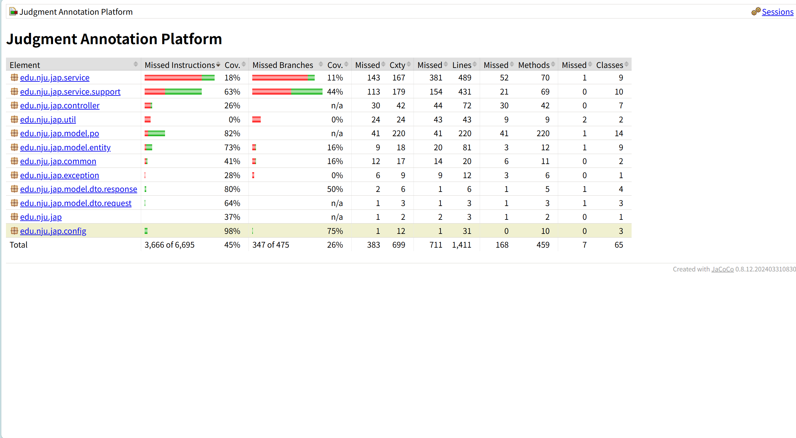
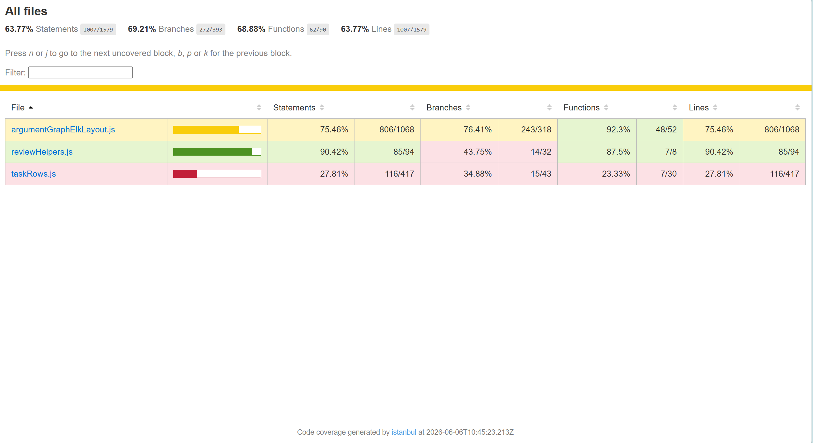

# 单元测试与集成测试报告

**团队：第44组**

**日期：6月6日**

## 1. 测试目标

本次补充测试体系的目标是满足课程验收中关于测试的要求：

- 核心模块单元测试覆盖率不低于 60%。
- 集成测试覆盖至少 1 个完整正常流程和 2 个异常流程。
- 后端测试不依赖本地 MySQL，使用 H2 内存数据库隔离测试环境。
- 前端测试优先覆盖核心工具函数，不强制测试 Vue 页面组件。

## 2. 测试技术栈

### 2.1 后端

- JUnit 5
- Spring Boot Test
- MockMvc
- Mockito
- H2 Database
- JaCoCo Maven Plugin

### 2.2 前端

- Vitest
- @vitest/coverage-v8
- jsdom

## 3. 后端测试位置

后端测试文件位于：

```text
backend/src/test/
```

### 3.1 测试配置与测试数据

| 文件 | 说明 |
| --- | --- |
| `backend/src/test/resources/application-test.yml` | 测试环境配置，使用 H2 内存数据库 |
| `backend/src/test/resources/test-db/schema.sql` | H2 测试库表结构 |
| `backend/src/test/resources/test-db/data.sql` | 测试账号、指南、文书、任务等种子数据 |

### 3.2 单元测试

| 测试文件 | 覆盖模块 | 主要测试内容 |
| --- | --- | --- |
| `backend/src/test/java/edu/nju/jap/service/AuthServiceTest.java` | 登录服务 | 登录成功、用户不存在、密码错误 |
| `backend/src/test/java/edu/nju/jap/service/GuideConfigLoaderTest.java` | 指南配置加载 | 加载存在版本、版本不存在抛出“指南版本不存在” |
| `backend/src/test/java/edu/nju/jap/service/AnnotationServiceTest.java` | 标注提交服务 | 命题按 `startPos` 重排、草稿不推进阶段、正式提交触发阶段同步 |
| `backend/src/test/java/edu/nju/jap/service/TaskServiceTest.java` | 任务服务 | 阶段向后推进规则、阶段回退冲突 |

### 3.3 集成测试

| 测试文件 | 覆盖流程 | 说明 |
| --- | --- | --- |
| `backend/src/test/java/edu/nju/jap/integration/AnnotationFlowIntegrationTest.java` | 标注接口完整流程 | 使用 MockMvc 走登录、我的任务、任务文书、读取标注数据、提交标注、再次读取验证保存 |

集成测试覆盖的异常流程：

| 异常流程 | 请求 | 预期 |
| --- | --- | --- |
| 未登录访问我的任务 | `GET /api/tasks/my` | 返回统一响应 `code=401` |
| 访问不存在的指南版本 | `GET /api/configs/versions/999` | 返回统一响应 `code=404`，`message=指南版本不存在` |

## 4. 前端测试位置

前端测试文件位于：

```text
frontend/src/utils/__tests__/
```

### 4.1 测试配置

| 文件 | 说明 |
| --- | --- |
| `frontend/vitest.config.js` | Vitest 配置，使用 V8 coverage，只统计核心工具函数 |
| `frontend/package.json` | 新增 `test` 和 `test:coverage` 脚本 |

### 4.2 单元测试

| 测试文件 | 覆盖模块 | 主要测试内容 |
| --- | --- | --- |
| `frontend/src/utils/__tests__/argumentGraphElkLayout.test.js` | 逻辑图示生成工具 | 组合/匹配关系合并加号、反对关系指向内层关系、支持关系黑点位置、同一关系矩形合并 |
| `frontend/src/utils/__tests__/taskRows.test.js` | 任务状态工具 | 标注提交后进入待裁定、裁定完成后可导出、双角色入口、导出操作 |
| `frontend/src/utils/__tests__/reviewHelpers.test.js` | 标注文本工具 | 查找非重叠文本区间、生成高亮文本切片、格式化关系公式 |

## 5. 如何运行测试

### 5.1 后端单元测试与集成测试

进入后端目录：

```bash
cd backend
```

运行全部测试：

```bash
mvn test
```

运行测试并生成 JaCoCo 覆盖率报告：

```bash
mvn verify
```

后端覆盖率报告位置：

```text
backend/target/site/jacoco/index.html
```

### 5.2 前端单元测试

进入前端目录：

```bash
cd frontend
```

首次运行前安装依赖：

```bash
npm install
```

运行测试：

```bash
npm run test
```

运行测试并生成覆盖率报告：

```bash
npm run test:coverage
```

前端覆盖率报告位置：

```text
frontend/coverage/index.html
```

## 6. 当前测试结果

### 6.1 后端结果

执行命令：

```bash
cd backend
mvn verify
```

当前结果：

```text
Tests run: 13, Failures: 0, Errors: 0, Skipped: 0
All coverage checks have been met.
BUILD SUCCESS
```

说明：

- 后端共执行 13 个测试。
- 单元测试覆盖登录、指南加载、标注提交、任务阶段规则。
- 集成测试覆盖 1 个完整正常流程和 2 个异常流程。
- JaCoCo 覆盖率阈值已通过。

**后端覆盖率**

### 6.2 前端结果

执行命令：

```bash
cd frontend
npm run test:coverage
```

当前结果：

```text
Test Files  3 passed (3)
Tests       11 passed (11)
All files   63.77% lines
```

说明：

- 前端共执行 11 个测试。
- 覆盖范围集中在 `src/utils` 下的核心工具函数。
- 当前总体行覆盖率为 63.77%，满足 60% 要求。

**前端覆盖率**



### 6.3 前端构建验证

执行命令：

```bash
cd frontend
npm run build
```

当前结果：

```text
✓ built
```

说明：

- 新增测试依赖和 Vitest 配置后，前端生产构建仍可正常通过。
- Vite 的 chunk size warning 属于依赖体积提示，不影响运行。

## 7. CI/CD 调整

本次同步调整了 GitLab CI 配置：

| 文件 | 调整内容 |
| --- | --- |
| `.gitlab/backend.yml` | 后端构建命令从 `mvn clean package -DskipTests` 改为 `mvn clean verify` |
| `.gitlab/frontend.yml` | 前端构建前新增 `npm run test:coverage` |

调整后，合并请求或流水线执行时会先运行测试与覆盖率检查，再进行构建。

## 8. 结论

本次测试体系补充后，项目已经具备基础自动化测试能力：

- 后端具备服务层单元测试和接口级集成测试。
- 前端具备核心工具函数单元测试。
- 覆盖率检查已集成到本地 `verify` / `test:coverage` 命令和 CI 流程中。
- 当前测试结果满足“核心模块覆盖率 >= 60%”和“集成测试覆盖至少 1 个完整正常流程、2 个异常流程”的要求。
